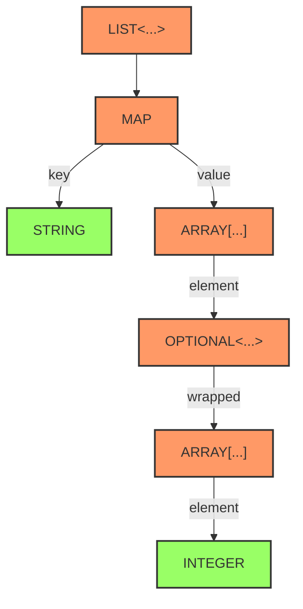

# No Framework Pickler Architecture

## Project Overview

**No Framework Pickler** is a lightweight, zero-dependency Java 21+ serialization library that generates type-safe, compact and fast, serializers for records containing value-like types as well as container-like types. This includes value-like types such as `UUID`, `String`, `enum` was well as container-like such as optionals, arrays, lists, and maps of value-like types. This is done by constructing type specific serializers using:
- **Abstract Syntax Tree construction** for the parameterized types of `record` components
- **Multi-stage programming** with a meta-stage during `Pickler.forClass(Class<?>)` construction that performs **static semantic analysis** to build an **Abstract Syntax Tree (AST)** representation of the type structure
- **Static semantic analysis** preserving type safety guarantees

### Recursive Type Analysis Algorithm

The analysis performs **recursive descent parsing** of Java's `Type` hierarchy:

1. **Container Recognition**: Identifies parameterized types (List<T>, Map<K,V>, Optional<T>) and arrays (T[])
2. **Recursive Decomposition**: Recursively analyzes type arguments to arbitrary depth
3. **AST Construction**: Builds parallel sequences of structural tags and concrete types
4. **Termination**: Reaches leaf nodes at primitive/user-defined types

### Abstract Syntax Tree (AST) Construction and Formal Grammar

The **static semantic analysis** implements **recursive descent parsing** of Java's Type hierarchy to construct **Abstract Syntax Trees** that represent the nested container structure of parameterized types. This AST construction enables **compile-time specialization** through **multi-stage programming**.

#### Formal EBNF Grammar

# Readable AST Grammar with Parenthesized Notation

## EBNF Grammar

```ebnf
TypeStructure ::= TypeExpression

TypeExpression ::= PrimitiveType | ContainerExpression

ContainerExpression ::= ArrayExpression 
                     | ListExpression 
                     | OptionalExpression 
                     | MapExpression

ArrayExpression ::= 'ARRAY(' TypeExpression ')'

ListExpression ::= 'LIST(' TypeExpression ')'

OptionalExpression ::= 'OPTIONAL(' TypeExpression ')'

MapExpression ::= 'MAP(' TypeExpression ',' TypeExpression ')'

PrimitiveType ::= 'BOOLEAN' | 'BYTE' | 'SHORT' | 'CHARACTER' 
                | 'INTEGER' | 'LONG' | 'FLOAT' | 'DOUBLE' 
                | 'STRING' | 'UUID' | 'ENUM' | 'RECORD' | 'INTERFACE'
```

## Examples with Tree Structure

### Simple Examples
- `boolean` → `BOOLEAN`
- `int[]` → `ARRAY(INTEGER)`
- `List<String>` → `LIST(STRING)`
- `Optional<Double>` → `OPTIONAL(DOUBLE)`
- `Map<String, Integer>` → `MAP(STRING, INTEGER)`

### Nested Examples
- `List<Double>[]` → `ARRAY(LIST(DOUBLE))`
- `Optional<String[]>` → `OPTIONAL(ARRAY(STRING))`
- `Map<String, List<Integer>>` → `MAP(STRING, LIST(INTEGER))`
- `List<Optional<Boolean>>` → `LIST(OPTIONAL(BOOLEAN))`

### Complex Nested Example
`List<Map<String, Optional<Integer[]>[]>>`

Breaking it down:
- Outer container: `List<...>`
- Inside List: `Map<String, Optional<Integer[]>[]>`
- Map key: `String`
- Map value: `Optional<Integer[]>[]`
- Inside array: `Optional<Integer[]>`
- Inside Optional: `Integer[]`

**Tree representation:**
```
LIST(
  MAP(
    STRING,
    ARRAY(
      OPTIONAL(
        ARRAY(INTEGER)
      )
    )
  )
)
```

## Algorithm for AST Construction

```
function parseType(type):
    if type is primitive:
        return type.toUpperCase()
    else if type is array (T[]):
        return "ARRAY(" + parseType(T) + ")"
    else if type is List<T>:
        return "LIST(" + parseType(T) + ")"
    else if type is Optional<T>:
        return "OPTIONAL(" + parseType(T) + ")"
    else if type is Map<K,V>:
        return "MAP(" + parseType(K) + "," + parseType(V) + ")"
```

## Test Case Generation

With this grammar, you can systematically generate test cases:

### Depth 1 (Primitives only)
- `BOOLEAN`, `BYTE`, `SHORT`, `CHARACTER`, `INTEGER`, `LONG`, `FLOAT`, `DOUBLE`, `STRING`, `UUID`

### Depth 2 (Single container)
- `ARRAY(P)` for each primitive P
- `LIST(P)` for each primitive P
- `OPTIONAL(P)` for each primitive P
- `MAP(P1, P2)` for each pair of primitives

### Depth 3 (Nested containers)
- `ARRAY(LIST(P))` → `List<P>[]`
- `LIST(ARRAY(P))` → `List<P[]>`
- `OPTIONAL(MAP(P1, P2))` → `Optional<Map<P1, P2>>`
- `MAP(P, LIST(P))` → `Map<P, List<P>>`
- etc.

## Benefits of This Notation

1. **Clear nesting**: Parentheses show exactly what contains what
2. **Explicit arity**: MAP always has exactly 2 arguments
3. **Easy to parse**: Both humans and machines can easily understand the structure
4. **Direct mapping**: Each expression maps directly to Java generic syntax
5. **Test generation**: Can systematically enumerate all possible type combinations up to a given depth

#### AST Construction Algorithm

The **recursive descent parser** implements the following algorithm:

1. **Container Recognition**: Identifies parameterized types (List<T>, Map<K,V>, Optional<T>) and arrays (T[])
2. **Recursive Decomposition**: Recursively analyzes type arguments to arbitrary depth using **typing context** preservation
3. **AST Construction**: Builds parallel sequences of structural tags and concrete types maintaining **type environment** (Γ)
4. **Termination**: Reaches leaf nodes at primitive/user-defined types

**Example Analysis**: `List<Map<String, Optional<Integer[]>[]>>`
# AST Construction Algorithm - Detailed Example

## Example Analysis: `List<Map<String, Optional<Integer[]>[]>>`

### Step-by-Step Parse Tree Construction

```
Input: List<Map<String, Optional<Integer[]>[]>>

Step 1: Recognize outer container
- Type: List<T> where T = Map<String, Optional<Integer[]>[]>
- Action: Extract LIST container, recurse on T
- AST so far: LIST(...)

Step 2: Parse T = Map<String, Optional<Integer[]>[]>
- Type: Map<K,V> where K = String, V = Optional<Integer[]>[]
- Action: Extract MAP container, recurse on K and V
- AST so far: LIST(MAP(..., ...))

Step 3a: Parse K = String
- Type: String (primitive)
- Action: Terminal node, add STRING
- AST so far: LIST(MAP(STRING, ...))

Step 3b: Parse V = Optional<Integer[]>[]
- Type: Array of Optional<Integer[]>
- Action: Extract ARRAY container, recurse on element type
- AST so far: LIST(MAP(STRING, ARRAY(...)))

Step 4: Parse element = Optional<Integer[]>
- Type: Optional<T> where T = Integer[]
- Action: Extract OPTIONAL container, recurse on T
- AST so far: LIST(MAP(STRING, ARRAY(OPTIONAL(...))))

Step 5: Parse T = Integer[]
- Type: Array of Integer
- Action: Extract ARRAY container, recurse on element type
- AST so far: LIST(MAP(STRING, ARRAY(OPTIONAL(ARRAY(...)))))

Step 6: Parse element = Integer
- Type: Integer (primitive)
- Action: Terminal node, add INTEGER
- AST so far: LIST(MAP(STRING, ARRAY(OPTIONAL(ARRAY(INTEGER)))))

Final AST: LIST(MAP(STRING, ARRAY(OPTIONAL(ARRAY(INTEGER)))))
```

### Detailed Trace with Type Environment

```
parseType("List<Map<String, Optional<Integer[]>[]>>")
├─ recognize: List<...>
├─ extract type parameter: Map<String, Optional<Integer[]>[]>
└─ return: LIST(parseType("Map<String, Optional<Integer[]>[]>"))
   │
   └─ parseType("Map<String, Optional<Integer[]>[]>")
      ├─ recognize: Map<...,...>
      ├─ extract key type: String
      ├─ extract value type: Optional<Integer[]>[]
      └─ return: MAP(parseType("String"), parseType("Optional<Integer[]>[]"))
         │
         ├─ parseType("String")
         │  └─ return: STRING (primitive)
         │
         └─ parseType("Optional<Integer[]>[]")
            ├─ recognize: ...[] (array)
            ├─ extract element type: Optional<Integer[]>
            └─ return: ARRAY(parseType("Optional<Integer[]>"))
               │
               └─ parseType("Optional<Integer[]>")
                  ├─ recognize: Optional<...>
                  ├─ extract type parameter: Integer[]
                  └─ return: OPTIONAL(parseType("Integer[]"))
                     │
                     └─ parseType("Integer[]")
                        ├─ recognize: ...[] (array)
                        ├─ extract element type: Integer
                        └─ return: ARRAY(parseType("Integer"))
                           │
                           └─ parseType("Integer")
                              └─ return: INTEGER (primitive)
```

### Type Environment (Γ) at Each Step

```
Γ₀: { current: "List<Map<String, Optional<Integer[]>[]>>" }
Γ₁: { current: "Map<String, Optional<Integer[]>[]>", parent: List }
Γ₂: { current: "String", parent: Map.key }
Γ₃: { current: "Optional<Integer[]>[]", parent: Map.value }
Γ₄: { current: "Optional<Integer[]>", parent: Array }
Γ₅: { current: "Integer[]", parent: Optional }
Γ₆: { current: "Integer", parent: Array }
```

### Parallel Sequences (Original Format)

```
Tags:     LIST MAP STRING ARRAY OPTIONAL ARRAY INTEGER
Types:    List.class Map.class String.class Arrays.class Optional.class Arrays.class int.class
```

### Tree Visualization

Here is it with labels: 


    
### No-Reflection Principle

*Core Design Philosophy:* The library avoids reflection on the Object-stage (Runtime) "hot path"  for performance.
All reflective operations are done during Meta-stage (Construction Time) in `Pickler.forClass(Class<?>)`. 
This construction resolves method handles and creates delegation chains that are used at runtime without further reflection.

**Meta-Stage (Construction Time)**:
- **Type Discovery**: Exhaustively discover ALL reachable types from root class using **recursive descent parsing**
- **AST Construction**: Build **Abstract Syntax Trees** for each component's generic type structure using `MetaStage.analyze()`
- **Type Environment**: Build global lookup tables indexed by ordinal for O(1) operations, preserving **typing context** (Γ)
- **Method Handle Caching**: Cache method handles for record constructors and field accessors using `MetaStage.forRecord()`
- **Stable Ordering**: Sort discovered classes lexicographically for stable ordinals
- **Static Analysis**: Create `TypeStructureAST` for generic components
    - Example: `UserRecord[]` → AST: `[TagWithType(ARRAY, Arrays.class), TagWithType(RECORD, UserRecord.class)]`
    - Pre-resolve all user type ordinals and close over them in writers/readers/sizers
    - Eliminates need for runtime type inspection or map lookups on hot path (except one case explained below)
- **Tag vs Constants Distinction**: `StructuralTag` enum represents logical types at **static semantic analysis** (OPTIONAL, ARRAY, RECORD). `Constants` enum represents runtime wire markers (OPTIONAL_EMPTY, OPTIONAL_OF, specific ordinals)
- **Collections Writer Pattern**: Lists, Maps and Arrays have boxed types and delegate to a chained writer per element
- **Collections Arrays Pattern**: Arrays can optimise _some_ but not all writes:
    - `byte[]` is directly written as `ByteBuffer#put(bytes)`
    - `boolean[]` is packed as a `BitSet` then written as `ByteBuffer#put(bytes)`
    - `int[]`/`long[]` arrays are sampled for up to 32 elements to estimate if ZigZagEncoding will save space. If so they are written as varint/varlong and if not they are written as `putInt` or `putLong` leaf nodes in delegation chains
    - `Record[]` and `Enum[]` are written as RECORD or ENUM markers and then elements are written using the record or enum writer

**Object-Stage (Runtime)**:
- Execute pre-built delegation chains without type inspection
- Use cached method handles for optimal performance
- Leverage **staging context** for specialized serialization paths

#### Delegation Chain Construction

The AST enables **right-to-left metaprogramming**:
- **Leaf-first construction**: Build primitive type handlers first
- **Container wrapping**: Wrap primitive handlers with container logic
- **Delegation chains**: Each container delegates to its component handlers
- **Compile-time optimization**: Eliminate all runtime type inspection

### Chaining Writers and Readers

The **static semantic analysis** always has containers on the left, of any depth, and the leaf types on the right. This means we walk from right→left to create inner→outer delegation chains where outer writers delegate to inner writers. What we delegate to must exist before the thing that delegates from it. So we construct right→left and chain them to run left→right→left. The outer writers write their type marker and then delegate. This means that the wire markers reflect the AST structure:

`List<Optional<Person[]>>` →
`[LIST, OPTIONAL, ARRAY, RECORD]` →
`[-1*Constants.LIST.ordinal(), -1*Constants.OPTIONAL.ordinal(), -1*Constants.ARRAY.ordinal(), 1 + classToOrdinal(Person.class)]`

It is then clear that the reader chain will have to read this in wire order to know that it has to go in reverse order. We first run through the outer readers which will do null checks and only if they should not use null will delegate to the inner readers. This will walk down the `[LIST, OPTIONAL, ARRAY, RECORD]` and it will be the innermost container, in this case ARRAY, that will read the length and invoke the specific record reader for many `Person` instances.

We should note that `[ARRAY, OPTIONAL, LIST, PERSON]` has absolutely no difference. We can have `[ARRAY, OPTIONAL, LIST, LIST, OPTIONAL, ARRAY, PERSON]` or whatever. We are simply doing the same **staged metaprogramming** pattern.

**Wire Protocol Encoding**:
- **Built-in types** (String, Integer, etc.): Write negative index (e.g., `-1 * Constants.STRING.ordinal()`)
- **User types** (Records, Enums): Write positive index into discovered types array (1-indexed: `ordinal + 1`)

**Deserialization Order**: Must materialize leaf-first (inside-out) - you cannot create a container until its contents exist. The reader chain naturally enforces this by reading the deepest elements first.

**Why This Architecture**: The AST abstraction allows uniform handling despite Java's syntax differences between arrays (postfix) and generics (prefix). The parallel `TagWithType` lists enable O(1) lookups during **meta-stage programming** without runtime type inspection.

### Performance Characteristics

**O(1) Operations**:
- **Type lookup**: Direct array indexing replaces `Map#get` overhead for almost all cases except one small case on the write path
- **Method invocation**: Pre-cached MethodHandles, no reflection on hot path through **AST-guided specialization**
- **Memory layout**: Compact arrays, excellent cache locality

**Minimal Wire Overhead**:
- Single ordinal per user type (1 byte for first 127 types)
- No class name serialization or compression needed
- Optimal encoding for common cases

### Backwards/Forwards Compatibility Strategy

In the older generation architecture we wrote class names and enum names so that in the future new types can be ignored or skipped over. In the new architecture if the user adds a new Enum or Record user type then the ordinal will be set by lexicographical ordering on the class names. This will be a breaking change. Yet backwards and forwards compatibility is opt-in. Some users will never need this. It is solved in things like protocol buffers by managing ordering via a mapping file which is a .proto file. If a user needs to support backwards and forwards compatibility then they must give us an ordinal mapping where they have not put in a breaking change of adding a new class at an ordinal of an existing class. The application user can give us a different ordinal map of classes and we can validate that it is complete. We can provide diagnostic tools to make it easier to get that correct or an easier 'migrations tool' or such. We do not need to solve that now as it is a migration path between old and new user code that can be made easier yet we need peak performance for users who are not opting into that feature as it is unnecessary for them.

### Buffer Allocation and maxSizeOf Strategy

**The maxSizeOf method is an optional hot path**. While serialize/deserialize are always on the hot path, maxSizeOf usage depends on the application's buffer allocation strategy:

1. **Fixed Buffer Pools**: Applications with predictable message sizes can pre-allocate fixed-size buffers and reuse them. These applications never call maxSizeOf.

2. **Dynamic Allocation**: Applications with variable message sizes (following power-law distributions where most messages are <1KB but occasional "monster" messages exist) benefit from maxSizeOf to avoid:
    - Pre-allocating monster buffers for all messages (wastes memory, increases GC pressure)
    - Buffer overflow exceptions from undersized allocations

3. **Performance Consideration**: When maxSizeOf is used, it's called for EVERY message before serialization. Therefore, any HashMap lookups in maxSizeOf must be hoisted into the pre-computed structures just like serialize/deserialize paths through **AST-guided optimization**.

## Recursive Metaprogramming Pattern

No Framework Pickler's ability to handle arbitrarily nested container types is achieved through a **recursive metaprogramming pattern** implemented at construction time through **AST construction** and **static semantic analysis**. This pattern is the key to supporting deeply nested structures without any special-case code or runtime type inspection.

### The Core Pattern: Abstract Syntax Tree Construction

When you create a pickler, the system performs **static semantic analysis** on all reachable types using **recursive descent parsing**. For each component type, it:

1. **Analyzes the type structure** using `MetaStage.analyze()`, which recursively unwraps:
    - Generic types (List<T>, Map<K,V>, Optional<T>)
    - Array types (T[], T[][], etc.)
    - Raw types to their component types

2. **Builds delegation chains** from right-to-left (leaf to outer container) using **AST-guided metaprogramming**:
    - `buildWriterChain()` - Creates serialization lambdas from **TypeStructureAST**
    - `buildReaderChain()` - Creates deserialization lambdas from **TypeStructureAST**
    - `buildSizerChain()` - Creates size computation lambdas from **TypeStructureAST**

### Runtime Performance

At runtime, there's zero type inspection or switching. The pre-built delegation chains execute as direct method handle invocations through **object-stage specialization**. Whether you have:
- `List<List<List<Double>>>` (deeply nested lists)
- `Map<String, Optional<Record[]>[]>` (mixed containers)
- `Optional<Map<Integer, List<String[]>>>` (complex nesting)

The same **recursive AST pattern** handles them all automatically. The **static semantic analysis** and chain building happen once at construction time (**meta-stage**), resulting in optimal runtime performance with no HashMap lookups or switch statements on the hot path.

### Implementation Details

The key methods that implement this pattern leverage **AST construction**:
- `MetaStage.analyze()` - Performs the **recursive descent parsing** and **AST construction**
- `MetaStage.forRecord()` - Builds **TypeStructureAST** arrays for record components
- `buildWriterChain()` - Builds serialization delegation chain from **AST**
- `buildReaderChain()` - Builds deserialization delegation chain from **AST**
- `buildSizerChain()` - Builds size computation chain from **AST**

Each method uses the **TypeStructureAST** to enable **compile-time specialization** where the **type environment** (Γ) is preserved and used to generate optimal delegation chains without runtime type inspection.

### Wire Protocol: 1-Indexed Logical Ordinals

**Safety First Design**:
- `0` = NULL marker (safe for uninitialized memory buffers)
- Negative numbers (-1, -2, etc.) = Built-in types (int, String, etc.)
- **Positive numbers (1, 2, 3, etc.) = User types with 1-indexed logical ordinals**

**Ordinal Mapping**:
- **Logical ordinal 1** → **Physical array index 0** (first discovered type)
- **Logical ordinal 2** → **Physical array index 1** (second discovered type)
- etc.

**Memory Safety Benefit**: Accidental zero-filled buffers become `null` instead of crashing on invalid array access.

### Serialization Strategy

**Top-Level Objects**:
1. Write logical ordinal (1, 2, 3, ...) using `Constants.marker()` for built-in types or `classToOrdinal(clazz) + 1` for user types which will correctly write `-1 * ordinal` for built-in types and `index + 1` for user types
2. Based on AST tag, serialize type-specific content:
    - **ENUM**: Write `enum.ordinal()`
    - **RECORD**: Recursively serialize all components via `serializeRecordComponents()`

**Record Components**:
- Built-in types: Write negative marker + value
- User types: Write logical ordinal + recursive content
- NULL values: Write 0 marker

### Deserialization Strategy

**Ordinal-to-Type Lookup**:
1. Read logical ordinal from buffer
2. Convert to physical array index: `physicalIndex = logicalOrdinal - 1`
3. Look up type: `discoveredClasses[physicalIndex]`
4. Dispatch based on AST tag: `tags[physicalIndex]`

**Type-Specific Deserialization**:
- **ENUM**: Read constant name, use `Enum.valueOf()`
- **RECORD**: Read all components, invoke constructor via `MethodHandle`

### Wire Protocol Design

- Negative ordinals (-1, -2, -3...): Built-in types (int, String, etc.)
- Positive ordinals (1, 2, 3...): User types (1-indexed logical, 0-indexed physical)
- Zero (0): NULL marker for memory safety

**Wire Protocol Implementation**:
- **Negative markers**: Built-in types (STRING, UUID, primitives) use negative ZigZag encoded values
- **Positive markers**: User types use array index as ZigZag encoded ordinal
- **NULL marker**: Remains 0 (uninitialized memory safety)
- **No Class Name Serialization**: Ordinals eliminate need for class name compression
- Our built-in value types in `Constants` have a `marker()` method that returns `-1*ordinal()` which is their position in the enum's logical `values()` array yet we do not need to use that physical method as we use the `ordinal()` API
- The user types are stored in the `discoveredClasses` array and we use `classToOrdinal(clazz)` to get the ordinal of the class. We can then `+1` to not overlap with the built-in ordinals
- We ZigZag encode the ordinals which are typically tiny so typically only one byte on the wire. This is a vast performance improvement over writing class names as strings

We will likely never put in more than 63 future built-in types and the application will likely never have more than 63 user types for one pickler so we will get a one byte encoding. Yet we have no such artificial limit - we can support up to 2^31 types of each.

End. 
