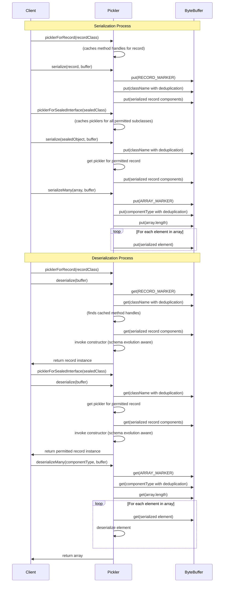

# No Framework Pickler

A tiny serialization library that generates elegant, fast, type-safe serializers for Java records and sealed interfaces in a single Java source file — perfect for building elegant message protocols using modern idiomatic Java.
It supports nested records, arrays, maps and simple enum constants. Binary backwards compatibility is enabled through alternative constructors and adding components to the end of the record declaration (see Schema Evolution section below).

```java
// Given a sealed interface and its permitted record types:
public sealed interface TreeNode permits TreeNode.InternalNode, TreeNode.LeafNode {
  record LeafNode(int value) implements TreeNode { }
  record InternalNode(String name, TreeNode left, TreeNode right) implements TreeNode { }
}

// And a pickler for the sealed interface:
Pickler<TreeNode> treeNodePickler = Pickler.forSealedInterface(TreeNode.class);

// When we serialize a tree of nodes to a ByteBuffer:
ByteBuffer buffer = ByteBuffer.allocate(1024);
treeNodePickler.serialize(rootNode, buffer);

// And deserialize it back:
buffer.flip();
TreeNode deserializedRoot = treeNodePickler.deserialize(buffer);

// Then the deserialized tree structure is identical to the original

```

It works with nested sealed interfaces of permitted record types or an outer array of such where the records may contain arbitrarily nested:

 - boolean.class
 - byte.class
 - short.class
 - char.class
 - int.class
 - long.class
 - float.class
 - double.class
 - String.class
 - Optional.class
 - Record.class
 - Map.class
 - List.class
 - Enum.class
 - Arrays of the above

When handling sealed interfaces it is requires all permitted subclasses within the sealed hierarchy must be either records or sealed interfaces of records. This allows you to use record patterns with type safe exhaustive switch statements. 

This library if very fast as it avoids reflection on the hot patch by caching MethodHandle which are resolved through reflection when you construct the pickler.  This project is fully functional with 1 Java source file with less than 1,500 lines of code. It creates a single Jar file with no dependencies that is less than 35k in size. 

## Usage

### Basic Record Serialization

```java
/// Define a record using the enum. It **must** be public
public record Month(Season season, String name) {}

/// Define a simple enum with no fields so no custom constructor. It **must** be public
public enum Season { SPRING, SUMMER, FALL, WINTER }

// Create an instance
var december = new Month(Season.WINTER, "December");

// Get a pickler for the record type containing the enum
Pickler<Month> pickler = Pickler.picklerForRecord(Month.class);

// Calculate size and allocate buffer
int size = pickler.sizeOf(december);
ByteBuffer buffer = ByteBuffer.allocate(size);

// Serialize to a ByteBuffer
pickler.serialize(december, buffer);
buffer.flip();

// Deserialize from the ByteBuffer
Month deserializedMonth = pickler.deserialize(buffer);

// Verify the deserialized enum value
if (!deserializedMonth.equals(december)) {
    throw new AssertionError("should not be reached");
}
```

### Nested Record Tree

```java
import io.github.simbo1905.no.framework.Pickler;

/// The sealed interface and all permitted record subclasses must be public
/// Nested sealed interfaces are supported. Yet all concrete types must be records with support components
public sealed interface TreeNode permits RootNode, InternalNode, LeafNode {
}

public record RootNode(TreeNode left, TreeNode right) implements TreeNode {
}

public record InternalNode(String name, TreeNode left, TreeNode right) implements TreeNode {
}

public record LeafNode(int value) implements TreeNode {
}

final var leaf1 = new LeafNode(42);
final var leaf2 = new LeafNode(99);
final var leaf3 = new LeafNode(123);
// A lob sided tree
final var internal1 = new InternalNode("Branch1", leaf1, leaf2);
final var internal2 = new InternalNode("Branch2", leaf3, null);
final var originalRoot = new RootNode(internal1, internal2);

// Get a pickler for the TreeNode sealed interface
final var pickler = Pickler.forSealedInterface(TreeNode.class);

// Calculate buffer size needed for the whole graph reachable from the root node
final var bufferSize = pickler.sizeOf(originalRoot);

// Allocate a buffer to hold just the root node
final var buffer = ByteBuffer.allocate(bufferSize);

// Serialize only the root node (which should include the entire graph)
pickler.

serialize(originalRoot, buffer);

// Prepare buffer for reading
buffer.

flip();

// Deserialize the root node (which will reconstruct the entire graph)
final var deserializedRoot = pickler.deserialize(buffer);

// See junit tests that Validates the entire tree structure was properly deserialized
validateTreeStructure(deserializedRoot);

// A lob sided tree
final var internal1 = new InternalNode("Branch1", leaf1, leaf2);
final var internal2 = new InternalNode("Branch2", leaf3, null);
final var root = new RootNode(internal1, internal2);

// Get a pickler for the TreeNode sealed interface
final var pickler = picklerForSealedTrait(TreeNode.class);

// Calculate buffer size needed for the whole graph reachable from the root node
final var bufferSize = pickler.sizeOf(originalRoot);

// Allocate a buffer to hold just the root node
final var buffer = ByteBuffer.allocate(bufferSize);

// Serialize only the root node (which should include the entire graph)
pickler.

serialize(originalRoot, buffer);

// Prepare buffer for reading
buffer.

flip();

// Deserialize the root node (which will reconstruct the entire graph)
final var deserializedRoot = pickler.deserialize(buffer);

// See junit tests that Validates the entire tree structure was properly deserialized
validateTreeStructure(deserializedRoot);
```

### Returned List Components And Map Components Are Immutable

All deserialized list inside of Records are immutable.  

```java
// Create a record with nested lists
record NestedListRecord(List<List<String>> nestedList) {
}

// Make the inner lists.
List<List<String>> nestedList = new ArrayList<>();
nestedList.add(Arrays.asList("A", "B", "C"));
nestedList.add(Arrays.asList("D", "E"));

// The record has mutable inner lists
NestedListRecord original = new NestedListRecord(nestedList);

// Get a pickler for the record
Pickler<NestedListRecord> pickler = Pickler.forRecord(NestedListRecord.class);

// Calculate size and allocate buffer
int size = pickler.sizeOf(original);
ByteBuffer buffer = ByteBuffer.allocate(size);

// Serialize
pickler.serialize(original, buffer);
buffer.flip();

// Deserialize
NestedListRecord deserialized = pickler.deserialize(buffer);

// The returned inner lists are immutable
assertThrows(UnsupportedOperationException.class, () -> deserialized.nestedList().removeFirst());
```

Maps within records are also returned as immutable:

```java

public record NestedFamilyMapContainer(Person subject, Map<String, Person> relationships) {}

Person john = new Person("John", 40);
Person michael = new Person("Michael", 65);
Person sarah = new Person("Sarah", 63);

Map<String, Person> familyMap = new HashMap<>();
familyMap.put("father", michael);
familyMap.put("mother", sarah);

final var original = new NestedFamilyMapContainer(john, familyMap);

// Get a pickler for the record
final var pickler = picklerForRecord(NestedFamilyMapContainer.class);
// Calculate size and allocate buffer
int size = pickler.sizeOf(original);
ByteBuffer buffer = ByteBuffer.allocate(size);
// Serialize
pickler.serialize(original, buffer);
// Prepare buffer for reading
buffer.flip();
// Deserialize
NestedFamilyMapContainer deserialized = pickler.deserialize(buffer);
// The returned inner map are immutable
assertThrows(UnsupportedOperationException.class, () -> deserialized.relationships().put("brother", new Person("Tom", 35)));
```

### Complex Nested Sealed Interfaces

This example shows how to serialize and deserialize a heterogeneous array of records that implement a sealed interface. The records are nested within the sealed interface hierarchy, and the serialization process handles the complexity of the nested structure:

```java
// Protocol
sealed interface Animal permits Mammal, Bird, Alicorn {}
sealed interface Mammal extends Animal permits Dog, Cat { }
sealed interface Bird extends Animal permits Eagle, Penguin {}
public record Alicorn(String name, String[] magicPowers) implements Animal {}
public record Dog(String name, int age) implements Mammal {}
public record Cat(String name, boolean purrs) implements Mammal {}
public record Eagle(double wingspan) implements Bird {}
record Penguin(boolean canSwim) implements Bird {}

// Create instances of all animal types
static Dog dog = new Dog("Buddy", 3);
static Dog dog2 = new Dog("Fido", 2);
static Animal eagle = new Eagle(2.1);
static Penguin penguin = new Penguin(true);
static Alicorn alicorn = new Alicorn("Twilight Sparkle", new String[]{"elements of harmony", "wings of a pegasus"});

static List<Animal> animals = List.of(dog, dog2, eagle, penguin, alicorn);
Pickler<Animal> pickler = Pickler.forSealedInterface(Animal.class);
final var buffer = ByteBuffer.allocate(1024);

// anyone reading back needs to know how many records to read back
animalBuffer.putInt(animals.size());

for (Animal animal : animals) {
    pickler.serialize(animal, buffer);
}

buffer.flip(); // Prepare for reading

// any service reading back needs to know how many records to read back
int size = animalBuffer.getInt();

// Deserialize the correct number of records
List<Animal> deserializedAnimals = new ArrayList<>(size);
IntStream.range(0, size).forEach(i -> {
Animal animal = animalPickler.deserialize(animalBuffer);
  deserializedAnimals.add(animal);
});
```

### Serialization And Deserialization Of Many Records

There are some optional static methods for dealing with many records of a specific type:

- `static <R extends Record> void serializeMany(R[] array, ByteBuffer buffer)`
- `static <R extends Record> List<R> deserializeMany(Class<R> componentType, ByteBuffer buffer)`
- `static <R extends Record> int sizeOfMany(R[] array)`

You use them like this:

```java
// Record type must be public
public record Person(String name, int age) {}
// Create an array of Person records
Person[] people = {
    new Person("Alice", 30),
    new Person("Bob", 25),
    new Person("Charlie", 40)
};
// Calculate size and allocate buffer
int size = Pickler.sizeOfMany(people);
ByteBuffer buffer = ByteBuffer.allocate(size);
// Serialize the array
Pickler.serializeMany(people, buffer);
// Prepare buffer for reading
buffer.flip();
// Deserialize the array
List<Person> deserializedPeople = Pickler.deserializeMany(Person.class, buffer);
// Verify the array was properly deserialized
assertEquals(people.length, deserializedPeople.size());
// The elements in the deserialized list should match the original array
IntStream.range(0, people.length)
    .forEach(i -> assertEquals(people[i], deserializedPeople.get(i)));
}
// The returned outer list is immutable
assertThrows(UnsupportedOperationException.class, () -> deserialized.removeFirst());
```

If you want to use this you need to be careful any attempts to convert Java Collections into array types: 

```java
Pickler<Animal> animalPickler = Pickler.forSealedInterface(Animal.class);
// The following code will compile but fail at runtime: 
Pickler.serializeMany(List.of(dog, dog2).toArray(Record[]::new), dogBuffer);
// The following code will not compile: 
Pickler.serializeMany(List.of(dog, dog2).toArray(Dog[]::new), dogBuffer);
```

Things get very challenging when trying to convert an array of instances of a sealed interfaces to an array of records. The safe thing to do is to explicitly create the array of records yourself and copy into them:

```java
Pickler<Animal> animalPickler = Pickler.forSealedInterface(Animal.class);
// Do not attempt to convert Java Collections into array types:
final var dogs = List.of(dog, dog2);
// You must explicitly create the array of records yourself and copy into it:
Dog[] dogArray = new Dog[dogs.size()];
// Shallow copy the list into the array:
java.util.Arrays.setAll(dogArray, i -> dogs.get(i));
// This is safe:
serializeMany(dogArray),dogBuffer);
```

If you want to avoid the shallow copy you can simply manually `writeInt` the size of the list and loop over the list to serialize each element:

```java
Pickler<Animal> animalPickler = Pickler.forSealedInterface(Animal.class);

// writing out on a loop: 
List<Dog> dogs = List.of(dog, dog2);
dogBuffer.writeInt(dogs.size());
for( Dog dog : dogs) {
    animalPickler.serialize(dog, dogBuffer);
}

dogBuffer.flip(); // Prepare for reading

// reading back on a loop:
int size = dogBuffer.readInt();
List<Dog> deserializedDogs = new ArrayList<>(size);
IntStream.range(0, size).forEach(i -> {
    deserializedDogs.addanimalPickler.deserialize(dogBuffer));
});
```

## Security

This library is secure by default by:

1. When you create a Pickler instance the `unreflect` method is used to make [Direct Method Handles](https://docs.oracle.com/en/java/javase/17/docs/api/java.base/java/lang/invoke/MethodHandleInfo.html#directmh) for the constructor(s) and component accessors
2. Using the JDK's `ByteBuffer` class to read and write binary data ensures that the bytes are validate by the JDK. 
3. Strings are explicitly using UTF8 bytes that are validated by the ByteArray `readUtf8` method.
4. The pickler resolves what are the legal permitted class names of all records within a sealed interface hierarchy at when you create the pickler; not when you are deserializing.
5. There is logic for backwards and forwards compatibility of `records`. This is disabled by default so you must explicitly enable it.
6. Java has specifically created `record` types to model data transfer objects safely. The backwards and forwards compatibility logic matches deserialization components to constructors. The JDK ensures that the canonical constructor is always called so that `record` types are always properly initialized.
7. The JDK ensures that nested `record` types can only be constructed bottom-up. This ensures that the deserialization logic behaves like normal Java code with no reflection tricks.
8. When `MethodHandle`s are invoked they validate the types and numbers of parameters are correct. 

If you instantiate a pickler for a `sealed interface` it ensures that the permitted types of the sealed interface are all `record` types else nested `sealed interface`s of records. It then builds a map of the validated classNames to the correct classes. When it reads back the class type strings this is via the `ByteBuffer` method `readUtf8`. It then checks that string against the map of permitted class names to classes. It then delegates to the pickler for the concrete record.

## Schema Evolution

No Framework Pickler supports **opt-in** schema evolution through: 

- **Additive-only schema evolution**: You can add new fields to the end of a record definition.
- **Backward compatibility constructors**: You must add a constructor that matches the older version which means that the order of the fields matches the old code so that when the old code sends an array of components it matches your new constructor.
- **Default values for new fields**: Java will force you to call the default constructor of your new code so it will force you to set the new fields added to the end as `null` or the default value that you want to use.

To enable backward compatibility when adding fields to a record, you must define a public constructor that accepts the exact parameter list the old code writes out. This means the number of parameters, order of parameters and types of parameters must match what you old code send. They are sent in source code order not by name. So you must only add new components to the end of the record definition. As components are written out and read back in based on source code order not by name you may rename any of your components in the new code.

This feature is disabled by default. A system property `no.framework.Pickler.Compatibility` must be set to one of three values to enable schema evolution.

```shell
-Dno.framework.Pickler.Compatibility=NONE|BACKWARDS|FORWARDS|ALL
```

### Example: Adding a Field to a Record

Consider a scenario with two microservices communicating with each other:

**Original Record (used by older microservice):**
```java
package com.example.protocol;

public record UserInfo(String name, int personalAccessLevel) {
}
```

**Evolved Record (used by newer microservice):**
```java
package com.example.protocol;

/// It is fine to rename components as `MethodHandles` are resolved by position in the code not by source code name
public record UserInfo(String username, int accessLevel, String department) {
    // Default value for backward compatibility
    private static final String DEFAULT_DEPARTMENT_FOR_LEGACY_RECORDS = "UNASSIGNED";
    
    // Backward compatibility constructor
    public UserInfo(String username, int accessLevel) {
        this(username, accessLevel, DEFAULT_DEPARTMENT_FOR_LEGACY_RECORDS);
    }
}
```

### Schema Evolution Summary

- Supports adding new components to the end of the record definition
- Requires explicit backward compatibility constructors matching the canonical constructor of the prior code
- Cannot remove or reorder existing fields
- Can reorder, remove or change the types of existing components
- You **may** change the name of components as the `MethodHandle` is resolved by position in source file not by name
- You **may** use `null` or set your own default value for added components within your backward compatibility constructor(s)

There are unit tests that dynamically compile and class load different versions of records to explicitly test both backwards and forwards compatibility across three generations. See `SchemaEvolutionTest.java` and `BackwardsCompatibilityTest.java` for examples of how to write your own tests.

## Wire Protocol

Support Types And Their Type Markers

| Type      | Type Marker |
|-----------|-------------|
| null | 	1          |
| Boolean | 	2          |
| Byte | 	 3         |
| Short | 	 4         |
| Character | 	5          |
| Integer | 6           |
| Long | 	 7         |
| Float | 	 8         |
| Double | 	 9         |
| String | 	10         |
| Optional | 	11         |
| Record | 	12         |
| Array | 	13         |
| Map | 	14         |
| Enum | 	15         |
| List | 	16         |

The wire protocol is explained in this diagram:



## Why Did Your Write This Framework Killer Code As A Single Java File?

No Framework Pickler came about because I was doing Java Data Oriented programming over sealed traits using Java 221. I wanted to quickly transmit them as a simple message protocol. Including large framework for something so basic seemed like a world of future security issues and forced upgrades. Doing something quick and simple in a single Java file felt right. I wanted to avoid reflection and found out: 

- The Java `record` types is specifically designed to be a safe data transfer object.
- The JDK's `ByteBuffer` class correctly validates UTF8 bytes for Strings and safely handles all primitive types.
- The JDK's `MethodHandle` class lets you `unreflect` them to get lower overhead [Direct Method Handles](https://docs.oracle.com/en/java/javase/17/docs/api/java.base/java/lang/invoke/MethodHandleInfo.html#directmh)
- Nested `sealed interfaces` that only contain `records` can be exhaustively matched switch statements to deconstruct the records are exactly what you need to model message protocol on Java 21+.

When I looked at just adding a bit more it all seemed easy enough. Until now the challenge with using record patterns in switch statements for a pure data exchange protocols are:

- The built-in Java Serialization mechanism is university loathed. Even if was magically fixed in future Java versions no-one will ever trust it
- Drop in replacements for java serialization like [Apache Fury](https://github.com/apache/fury/tree/main/java) at the time of writing only (v0.10.1) under `fure-core/src/main/java` has 229 java source files and 56,000 lines of code. The `fury-core-0.10.1.jar` Jar file is 1.9M in size.
- The historic way to deal with things is to use a "standard" protocol like  JDK Serialization, Protocol Buffers, Apache Avro, JSON, Hessian, Flatbuffers,, Thrift (TBinaryProtocol, TCompactProtocol, TJSONProtocol), MessagePack, XML, etc. 
- Picking any of those makes you have to learn and deal with the complexities and security vulnerabilities of libraries such as Kryo, Fst, Protostuff, Jsonb, Protobuf, Flatbuffers, Jackson, Thrift, Fury (when it is stable), FastJSON, JBoss Serialization, etc

That amount of choice is overwhelming. You are spoilt for choices you become a prisoner of then. The answer to avoid all this complexity is to leverage the modern JDK. We can then potentially free thousands of teams from thousands of hours of build time with a "no framework pickler" solution that replaces entire frameworks in a single Java file. 

## License

SPDX-FileCopyrightText: 2025 Simon Massey
SPDX-License-Identifier: Apache-2.0
