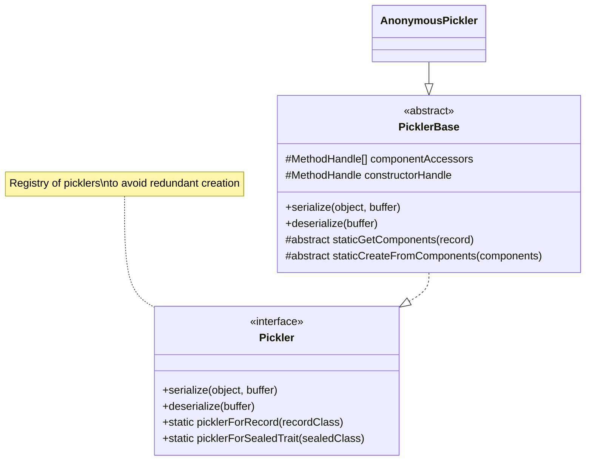

# Simple Pickler

Simple Pickler is a lightweight Java serialization library that dynamically generates serializers for Java records to
support type-safe message protocols. The library focuses on efficient binary serialization of immutable data structures.

## Overview

Simple Pickler provides a minimalist approach to serializing Java records and sealed interfaces. It works with:

- Records containing primitive types
- Strings
- Optional values
- Nested records
- Arrays (including primitive arrays, object arrays, and nested arrays)
- Sealed interfaces with record implementations

The library dynamically generates serializers at runtime, caching them for reuse to avoid redundant creation and
infinite recursion.

## Features

- **Zero Dependencies**: Pure Java implementation with no external dependencies
- **Binary Serialization**: Compact binary format for efficient data transfer
- **Type Safety**: Preserves the type information during serialization/deserialization
- **Support for Sealed Interfaces**: Enables polymorphic serialization
- **Nested Structure Support**: Handles complex data structures with nested records
- **Array Support**: Handles arrays of primitives, objects, and nested arrays
- **Optional Field Support**: Properly handles Optional values
- **Null Handling**: Safely serializes and deserializes null values

## Architecture



## Type Support

| Type      | Supported | Type Marker |
|-----------|-----------|-------------|
| Integer   | ✅         | 0           |
| Long      | ✅         | 1           |
| Short     | ✅         | 2           |
| Byte      | ✅         | 3           |
| Double    | ✅         | 4           |
| Float     | ✅         | 5           |
| Character | ✅         | 6           |
| Boolean   | ✅         | 7           |
| String    | ✅         | 8           |
| Optional  | ✅         | 9           |
| Record    | ✅         | 10          |
| null      | ✅         | 11          |
| Array     | ✅         | 12          |

## Usage Examples

### Basic Record Serialization

```java
// Define a simple record
record Person(String name, int age) {
}

// Create an instance
var person = new Person("Alice", 30);

// Get a pickler for the record type
Pickler<Person> pickler = Pickler.picklerForRecord(Person.class);

// Serialize to a ByteBuffer
ByteBuffer buffer = ByteBuffer.allocate(1024);
pickler.

serialize(person, buffer);
buffer.

flip();

// Deserialize from the ByteBuffer
Person deserializedPerson = pickler.deserialize(buffer);
```

### Working with Sealed Interfaces

```java
// Define a sealed interface hierarchy
sealed interface Shape permits Circle, Rectangle {
}

record Circle(double radius) implements Shape {
}

record Rectangle(double width, double height) implements Shape {
}

// Get a pickler for the sealed interface
Pickler<Shape> pickler = Pickler.picklerForSealedTrait(Shape.class);

// Serialize a specific implementation
Shape circle = new Circle(5.0);
ByteBuffer buffer = ByteBuffer.allocate(1024);
pickler.

serialize(circle, buffer);
buffer.

flip();

// Deserialize back to the correct implementation
Shape deserializedShape = pickler.deserialize(buffer);
// deserializedShape will be a Circle instance
```

### Complex Nested Structures

```java
// Define nested records
record Address(String street, String city, String zipCode) {
}

record Employee(String id, Person person, Address address) {
}

// Create a nested structure
Person person = new Person("John Doe", 35);
Address address = new Address("123 Main St", "Any Town", "12345");
Employee employee = new Employee("E12345", person, address);

// Get a pickler for the Employee record
Pickler<Employee> pickler = Pickler.picklerForRecord(Employee.class);

// Serialize and deserialize
ByteBuffer buffer = ByteBuffer.allocate(1024);
pickler.

serialize(employee, buffer);
buffer.

flip();

Employee deserializedEmployee = pickler.deserialize(buffer);
```

## Implementation Analysis

The implementation appears to match the description with some additional features:

1. **Core Functionality**: Dynamically generates serializers for Java records as described
2. **Additional Features**:
    - Support for arrays (including nested arrays)
    - Support for null values
    - Registry of picklers to avoid redundant creation

The library focuses on records containing primitive types, Strings, Optionals, and other records as described, but also
extends support to arrays and sealed interfaces, making it more versatile than the initial description suggests.

## Limitations

- Works only with records and sealed interfaces
- Does not support arbitrary object graphs
- No versioning support for schema evolution
- Not designed for cross-language serialization

## License

Apache-2.0
