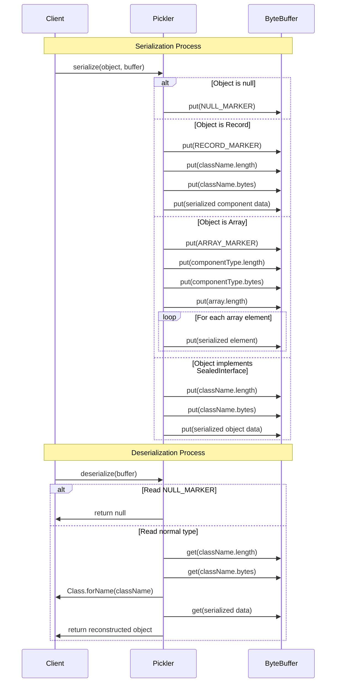

# Java Record Pickler

Java Record Pickler: A lightweight, zero-dependency serialization library for Java 21+ that generates type-safe, reflection-free serializers for records and sealed interfaces—perfect for building secure, modern message protocols with nested data structures and switch pattern matching.
It avoids excessive reflection when working with objects by caching MethodHandle. 
It works with nested sealed traits that permit nested simple records of simple types: 

- Records containing primitive types or String
- Optional of primitive types or String
- Arrays (including primitive arrays, object arrays, and nested arrays)
- Nested records that only contain the above type 
- Sealed interfaces with record implementations that only contain the above types
- Nested sealed interfaces that only contain the above types

Those restrictions are rich enough to build a message protocol suitable for using with record patterns in switch statements. 
Those are a Java 21 feature that makes working with message protocols much safer and easier. 

An example protocol could look like this:

```java
// Client to server messages
sealed interface StackCommand permits Push, Pop, Peek {}
record Push(String item) implements StackCommand {}
record Pop() implements StackCommand {}
record Peek() implements StackCommand {}
// Server responses
sealed interface StackResponse permits Success, Failure {
  String payload();
}
record Success(Optional<String> value) implements StackResponse {
  public String payload() { return value.orElse(null); }
}
record Failure(String errorMessage) implements StackResponse {
  public String payload() { return errorMessage;}
}
```

Note that there is deliberately no common interface between the client and server protocols. This means that we would 
create two type-safe picklers, one for the client and one for the server. This is a deliberate design choice to avoid 
needing to do unchecked casts when deserializing: 

```java
// Get picklers for the protocol interfaces
Pickler<StackCommand> commandPickler = Pickler.picklerForSealedTrait(StackCommand.class);
Pickler<StackResponse> responsePickler = Pickler.picklerForSealedTrait(StackResponse.class);
```

See the unit tests for many examples of using the library.

## Project Goals

The challenge with using record patterns in switch statements for message protocols are:

- The built-in Java Serialization mechanism is university loathed. Even if was magically fixed in future Java versions no-one will ever trust it
- Standard formats like Protobuf, Avro or JSON require 3rd party libraries dependencies that insist on adding security vulnerability due to "CV Driven Engineering"
- Java 8 boilerplate programming forces the use of kitchen sink frameworks that use the standard 3rd party libraries which then maximises to a certainly future critical security vulnerabilities

The goals of this codebase is to:

1. Write one piece of stable code that is a single Java source file
2. Never add features only fix any bugs
3. Never have any third party dependencies
4. Be good good enough to use for the internal communication between software. Remember perfection is the enemy of good. 

In order to use this code safely you need to ensure that payloads have not been tempered with. If you are not
doing that already then you are toast anyway due to all the future zero-day vulnerabilities of using popular 3rd party 
alternatives. Often just using properly using https between your services is "good enough" to ensure no tampering. You 
are already doing that, right? 

## Usage Examples

### Basic Record Serialization

```java
/// Define a simple record
/// The constructor must be public so that we can invoke the canonical constructor form the pickler package
public record Person(String name, int age) {
}

// Create an instance
var person = new Person("Alice", 30);

// Get a pickler for the record type
Pickler<Person> pickler = Pickler.picklerForRecord(Person.class);

// Serialize to a ByteBuffer
ByteBuffer buffer = ByteBuffer.allocate(1024);
pickler.serialize(person, buffer);
buffer.flip();

// Deserialize from the ByteBuffer
Person deserializedPerson = pickler.deserialize(buffer);
```

### Complex Nested Sealed Interfaces

```java
// Protocol
sealed interface Animal permits Mammal, Bird, Alicorn {}
sealed interface Mammal extends Animal permits Dog, Cat { }
sealed interface Bird extends Animal permits Eagle, Penguin {}
public record Alicorn(String name, String[] magicPowers) implements Animal {}
public record Dog(String name, int age) implements Mammal {}
public record Cat(String name, boolean purrs) implements Mammal {}
public record Eagle(double wingspan) implements Bird {}
record Penguin(boolean canSwim) implements Bird {}

// Create instances of all animal types
final var dog = new Dog("Buddy", 3);
final var cat = new Cat("Whiskers", true);
final var eagle = new Eagle(2.1);
final var penguin = new Penguin(true);
final var alicorn = new Alicorn("Twilight Sparkle", new String[]{"elements of harmony", "wings of a pegasus"});

// Create an array of all animals
final var originalAnimals = new Animal[]{dog, cat, eagle, penguin, alicorn};

// Get a pickler for the Animal sealed interface
final var pickler = picklerForSealedTrait(Animal.class);

// Calculate total buffer size needed using streams
final var totalSize = Arrays.stream(originalAnimals)
    .mapToInt(pickler::sizeOf)
    .sum();

// Allocate a single buffer to hold all animals
final var buffer = ByteBuffer.allocate(totalSize);

// Serialize all animals into the buffer using streams
        Arrays.stream(originalAnimals)
            .forEach(animal -> pickler.serialize(animal, buffer));

    // Prepare buffer for reading
    buffer.flip();

// Deserialize all animals from the buffer
final var deserializedAnimals = new Animal[originalAnimals.length];
        Arrays.setAll(deserializedAnimals, i -> pickler.deserialize(buffer));
```

### Trees Record Serialization

```java
/// Internal node that may have left and right children
/// Note the real coded in the unit tests has a null safe equals to compare the nodes with null children
public sealed interface TreeNode permits RootNode, InternalNode, LeafNode {}
public record RootNode(TreeNode left, TreeNode right) implements TreeNode {}
public record InternalNode(String name, TreeNode left, TreeNode right) implements TreeNode {}
public record LeafNode(int value) implements TreeNode {}
final var leaf1 = new LeafNode(42);
final var leaf2 = new LeafNode(99);
final var leaf3 = new LeafNode(123);

// A lob sided tree
final var internal1 = new InternalNode("Branch1", leaf1, leaf2);
final var internal2 = new InternalNode("Branch2", leaf3, null);
final var root = new RootNode(internal1, internal2);

// Get a pickler for the TreeNode sealed interface
final var pickler = picklerForSealedTrait(TreeNode.class);

// Calculate buffer size needed for the whole graph reachable from the root node
final var bufferSize = pickler.sizeOf(originalRoot);

// Allocate a buffer to hold just the root node
final var buffer = ByteBuffer.allocate(bufferSize);

// Serialize only the root node (which should include the entire graph)
pickler.serialize(originalRoot, buffer);

// Prepare buffer for reading
buffer.flip();

// Deserialize the root node (which will reconstruct the entire graph)
final var deserializedRoot = pickler.deserialize(buffer);

// See junit tests that Validates the entire tree structure was properly deserialized
validateTreeStructure(deserializedRoot);
```

## Wire Protocol

Support Types And Their Type Markers

| Type      | Type Marker |
|-----------|-------------|
| null | 	1          |
| Boolean | 	2          |
| Byte | 	 3         |
| Short | 	 4         |
| Character | 	5          |
| Integer | 6           |
| Long | 	 7         |
| Float | 	 8         |
| Double | 	 9         |
| String | 	10         |
| Optional | 	11         |
| Record | 	12         |
| Array | 	13         |

The wire protocol is explained in this diagram: 



## License

SPDX-FileCopyrightText: 2025 Simon Massey
SPDX-License-Identifier: Apache-2.0
