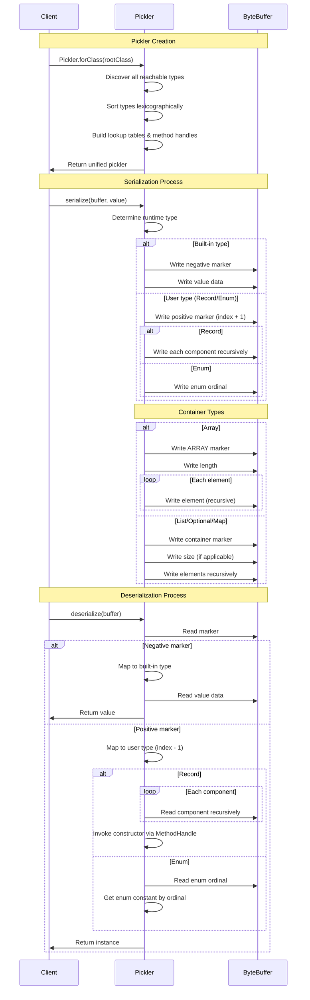

# No Framework Pickler

No Framework Pickler is a tiny serialization library that generates elegant, fast, type-safe serializers for Java records and sealed interface hierarchies of records — perfect for building elegant message protocols using modern Data Oriented Programming techniques:

```java
/// Given a sealed interface and its permitted record types using Java's new Data Oriented Programming paradigm:
public sealed interface TreeNode permits TreeNode.InternalNode, TreeNode.LeafNode, TreeNode.TreeEnum {
  record LeafNode(int value) implements TreeNode { }
  record InternalNode(String name, TreeNode left, TreeNode right) implements TreeNode { }
  enum TreeEnum implements TreeNode { EMPTY }
  static TreeNode empty() { return TreeEnum.EMPTY; }
  /// Sealed interfaces allow for exhaustively pattern matched within switch expressions
  static boolean areTreesEqual(TreeNode l, TreeNode r) {
    return switch (l) {
      case TreeEnum.EMPTY -> r == TreeEnum.EMPTY;
      case LeafNode(var v1) -> r instanceof LeafNode(var v2) && v1 == v2;
      case InternalNode(String n1, TreeNode i1, TreeNode i2) ->
          r instanceof InternalNode(String n2, TreeNode j1, TreeNode j2) &&
              n1.equals(n2) &&
              areTreesEqual(i1, j1) &&
              areTreesEqual(i2, j2);
    };
  }
}

// ByteBuffer for high performance serialization 
ByteBuffer buffer = ByteBuffer.allocate(1024);

// Given a tree of nodes:
final var rootNode = new TreeNode.InternalNode("Root",
    new TreeNode.InternalNode("Branch1", new TreeNode.LeafNode(42), new TreeNode.LeafNode(99)),
    new TreeNode.InternalNode("Branch2", new TreeNode.LeafNode(123), TreeNode.empty()));

// And a type safe pickler for the sealed interface:
Pickler<TreeNode> treeNodePickler = Pickler.forClass(TreeNode.class);

// When we serialize a tree of nodes to a ByteBuffer and load it back out again:
treeNodePickler.serialize(buffer, rootNode);
buffer.flip();
TreeNode deserializedRoot = treeNodePickler.deserialize(buffer);

// Then it has elegantly and safely reconstructed the entire tree structure
if( TreeNode.areTreesEqual(rootNode, deserializedRoot) ){
  System.out.println("The trees are equal!");
}
```

**No Framework Pickler is Java** where in a single line of code creates a typesafe pickler for a sealed interface hierarchy of records. There are no annotations. There are no build-time steps. There are n generated data structures you need to map to your regular code. There is no special configuration files. There is no manual just Java. You get all the convenience that the built-in JDK serialization with none of the downsides. 

**No Framework Pickler is fast** as it avoids reflection on the hot path by using the JDK's `unreflect` on the resolved constructors and component accessors of the Java records. This work is one once when the type-safe pickler is constructed. The cached [Direct Method Handles](https://docs.oracle.com/en/java/javase/17/docs/api/java.base/java/lang/invoke/MethodHandleInfo.html#directmh) then do the actual work. On some workloads it can be 2x faster than standard Java serialization while creating a binary payload that is 0.5x the size.

**No Framework Pickler is compact** as the entire codebase is in one Java source file with 1,300 lines of code not counting the extensive comments. It creates a single Jar file with no dependencies that is around 36k in size. It has no dependencies.  

**No Framework Pickler is safer** than many alternative approaches. The pickler resolves the legal code paths that regular Java code would take when creating the pickler; not when it is reading binary data. Bad data on the wire will never result in mal-constructed data structures with undefined behaviour. 

**No Framework Pickler is expressive** as it works out of the box with nested sealed interfaces of permitted record types or an outer array of such where the records may contain arbitrarily nested:

- boolean.class
- byte.class
- short.class
- char.class
- int.class
- long.class
- float.class
- double.class
- String.class
- Optional.class
- Record.class
- Map.class
- List.class
- Enum.class
- Arrays of the above

When handling sealed interfaces it is requires all permitted subclasses within the sealed hierarchy must be either records or sealed interfaces of records. This allows you to use record patterns with type safe exhaustive switch statements.

**No Framework Pickler backwards compatibility** supports opt-in binary compatibility for adding new components to the end of your `record` types. You simply provide alternative constructors in your newer code to match the default constructor of your old code. This is disabled by default.  

## Usage

### Basic Record Serialization

Here the optional `maxSizeOf` will recursively walk any large nested structures or arrays to calculate the exact size of the buffer needed to hold the serialized data:

```java
/// Define a record using the enum. It **must** be public
public record Month(Season season, String name) {}

/// Define a simple enum with no fields so no custom constructor. It **must** be public
public enum Season { SPRING, SUMMER, FALL, WINTER }

// Create an instance
var december = new Month(Season.WINTER, "December");

// Get a pickler for the record type containing the enum
Pickler<Month> pickler = Pickler.forClass(Month.class);

// Calculate size and allocate buffer
int size = pickler.maxSizeOf(december);
ByteBuffer buffer = ByteBuffer.allocate(size);

// Serialize to a ByteBuffer
pickler.serialize(buffer, december);
buffer.flip();

// Deserialize from the ByteBuffer
Month deserializedMonth = pickler.deserialize(buffer);

// Verify the deserialized enum value
if (!deserializedMonth.equals(december)) {
    throw new AssertionError("should not be reached");
}
```

### Nested Record Tree

```java
import io.github.simbo1905.no.framework.Pickler;

/// The sealed interface and all permitted record subclasses must be public.
/// The records can be static inner classes or top level classes.
/// Nested sealed interfaces are supported see the Animal example below.
public sealed interface TreeNode permits InternalNode, LeafNode, TreeEnum {
    static TreeNode empty() { return TreeEnum.EMPTY; }
}

public record InternalNode(String name, TreeNode left, TreeNode right) implements TreeNode {
}

public record LeafNode(int value) implements TreeNode {
}

public enum TreeEnum implements TreeNode {
    EMPTY
}

final var leaf1 = new LeafNode(42);
final var leaf2 = new LeafNode(99);
final var leaf3 = new LeafNode(123);
final var internal1 = new InternalNode("Branch1", leaf1, leaf2);
final var internal2 = new InternalNode("Branch2", leaf3, TreeNode.empty());
final var originalRoot = new InternalNode("Root", internal1, internal2);

// Get a pickler for the TreeNode sealed interface
final var pickler = Pickler.forClass(TreeNode.class);

// Calculate buffer size needed for the whole graph reachable from the root node
final var bufferSize = pickler.maxSizeOf(originalRoot);

// Allocate a buffer to hold the entire tree
final var buffer = ByteBuffer.allocate(bufferSize);

// Serialize the root node (which includes the entire graph)
pickler.serialize(buffer, originalRoot);

// Prepare buffer for reading
buffer.flip();

// Deserialize the root node (which will reconstruct the entire graph depth first)
final var deserializedRoot = pickler.deserialize(buffer);

// Validates the entire tree structure was properly deserialized
assertTrue(TreeNode.areTreesEqual(originalRoot, deserializedRoot), "Tree structure validation failed");
```

### Returned List Components And Map Components Are Immutable

All deserialized list inside of Records are immutable: 

```java
// Create a record with nested lists
record NestedListRecord(List<List<String>> nestedList) {
}

// Make the inner lists.
List<List<String>> nestedList = new ArrayList<>();
nestedList.add(Arrays.asList("A", "B", "C"));
nestedList.add(Arrays.asList("D", "E"));

// The record has mutable inner lists
NestedListRecord original = new NestedListRecord(nestedList);

// Get a pickler for the record
Pickler<NestedListRecord> pickler = Pickler.forClass(NestedListRecord.class);

// Calculate size and allocate buffer
int size = pickler.maxSizeOf(original);
ByteBuffer buffer = ByteBuffer.allocate(size);

// Serialize
pickler.serialize(buffer, original);
buffer.flip();

// Deserialize
NestedListRecord deserialized = pickler.deserialize(buffer);

// The returned inner lists are immutable
assertThrows(UnsupportedOperationException.class, () -> deserialized.nestedList().removeFirst());
```

Maps within records are also returned as immutable:

```java

public record NestedFamilyMapContainer(Person subject, Map<String, Person> relationships) {}

Person john = new Person("John", 40);
Person michael = new Person("Michael", 65);
Person sarah = new Person("Sarah", 63);

Map<String, Person> familyMap = new HashMap<>();
familyMap.put("father", michael);
familyMap.put("mother", sarah);

final var original = new NestedFamilyMapContainer(john, familyMap);

// Get a pickler for the record
final var pickler = Pickler.forClass(NestedFamilyMapContainer.class);
// Calculate size and allocate buffer
int size = pickler.maxSizeOf(original);
ByteBuffer buffer = ByteBuffer.allocate(size);
// Serialize
pickler.serialize(buffer, original);
// Prepare buffer for reading
buffer.flip();
// Deserialize
NestedFamilyMapContainer deserialized = pickler.deserialize(buffer);
// The returned inner map are immutable
assertThrows(UnsupportedOperationException.class, () -> deserialized.relationships().put("brother", new Person("Tom", 35)));
```

### Complex Nested Sealed Interfaces

This example shows how to serialize and deserialize a heterogeneous array of records that implement a sealed interface. The records are nested within the sealed interface hierarchy, and the serialization process handles the complexity of the nested data structures:

```java
// Protocol
sealed interface Animal permits Mammal, Bird, Alicorn {}
sealed interface Mammal extends Animal permits Dog, Cat { }
sealed interface Bird extends Animal permits Eagle, Penguin {}
public record Alicorn(String name, String[] magicPowers) implements Animal {}
public record Dog(String name, int age) implements Mammal {}
public record Cat(String name, boolean purrs) implements Mammal {}
public record Eagle(double wingspan) implements Bird {}
record Penguin(boolean canSwim) implements Bird {}

// Create instances of all animal types
static Dog dog = new Dog("Buddy", 3);
static Dog dog2 = new Dog("Fido", 2);
static Animal eagle = new Eagle(2.1);
static Penguin penguin = new Penguin(true);
static Alicorn alicorn = new Alicorn("Twilight Sparkle", new String[]{"elements of harmony", "wings of a pegasus"});

static List<Animal> animals = List.of(dog, dog2, eagle, penguin, alicorn);
Pickler<Animal> pickler = Pickler.forClass(Animal.class);
final var buffer = ByteBuffer.allocate(1024);

// anyone reading back needs to know how many records to read back
buffer.putInt(animals.size());

for (Animal animal : animals) {
    pickler.serialize(buffer, animal);
}

buffer.flip(); // Prepare for reading

// any service reading back needs to know how many records to read back
int size = buffer.getInt();

// Deserialize the correct number of records
List<Animal> deserializedAnimals = new ArrayList<>(size);
IntStream.range(0, size).forEach(i -> {
    Animal animal = pickler.deserialize(buffer);
    deserializedAnimals.add(animal);
});
```

### Serialization And Deserialization Of Multiple Records

When serializing multiple records, you need to manually track the count:

```java
// Create a pickler for your type
Pickler<Person> pickler = Pickler.forClass(Person.class);
List<Person> people = List.of(
    new Person("Alice", 30),
    new Person("Bob", 25),
    new Person("Charlie", 40)
);

ByteBuffer buffer = ByteBuffer.allocate(1024);

// Write the count first
buffer.putInt(people.size());

// Serialize each person
for (Person person : people) {
    pickler.serialize(buffer, person);
}

buffer.flip(); // Prepare for reading

// Read the count
int count = buffer.getInt();

// Deserialize each person
List<Person> deserializedPeople = new ArrayList<>(count);
for (int i = 0; i < count; i++) {
    deserializedPeople.add(pickler.deserialize(buffer));
}

// Verify the deserialization
assertEquals(people.size(), deserializedPeople.size());
for (int i = 0; i < people.size(); i++) {
    assertEquals(people.get(i), deserializedPeople.get(i));
}
```

## Security

This library is secure by default by:

1. When you create a Pickler instance the `unreflect` method is used to make [Direct Method Handles](https://docs.oracle.com/en/java/javase/17/docs/api/java.base/java/lang/invoke/MethodHandleInfo.html#directmh) for the constructor(s) and component accessors
2. Using the JDK's `ByteBuffer` class to read and write binary data ensures that the bytes are validate by the JDK. 
3. Strings are explicitly using UTF8 bytes that are validated by the ByteArray `readUtf8` method.
4. The pickler resolves what are the legal permitted class names of all records within a sealed interface hierarchy at when you create the pickler; not when you are deserializing.
5. There is logic for backwards and forwards compatibility of `records`. This is disabled by default so you must explicitly enable it.
6. Java has specifically created `record` types to model data transfer objects safely. The backwards and forwards compatibility logic matches deserialization components to constructors. The JDK ensures that the canonical constructor is always called so that `record` types are always properly initialized.
7. The JDK ensures that nested `record` types can only be constructed bottom-up. This ensures that the deserialization logic behaves like normal Java code with no reflection tricks.
8. When `MethodHandle`s are invoked they validate the types and numbers of parameters are correct. 

If you instantiate a pickler for a `sealed interface` it ensures that the permitted types of the sealed interface are all `record` types else nested `sealed interface`s of records. It then builds a map of the validated classNames to the correct classes. When it reads back the class type strings this is via the `ByteBuffer` method `readUtf8`. It then checks that string against the map of permitted class names to classes. It then delegates to the pickler for the concrete record.

## Schema Evolution

No Framework Pickler supports **opt-in** schema evolution through: 

- **Additive-only schema evolution**: You can add new fields to the end of a record definition.
- **Backward compatibility constructors**: You must add a constructor that matches the older version which means that the order of the fields matches the old code so that when the old code sends an array of components it matches your new constructor.
- **Default values for new fields**: Java will force you to call the default constructor of your new code so it will force you to set the new fields added to the end as `null` or the default value that you want to use.

To enable backward compatibility when adding fields to a record, you must define a public constructor that accepts the exact parameter list the old code writes out. This means the number of parameters, order of parameters and types of parameters must match what you old code send. They are sent in source code order not by name. So you must only add new components to the end of the record definition. As components are written out and read back in based on source code order not by name you may rename any of your components in the new code.

This feature is disabled by default. A system property `no.framework.Pickler.Compatibility` must be set to one of three values to enable schema evolution.

```shell
-Dno.framework.Pickler.Compatibility=NONE|BACKWARDS|FORWARDS|ALL
```

### Example: Adding a Field to a Record

Consider a scenario with two microservices communicating with each other:

**Original Record (used by older microservice):**
```java
package com.example.protocol;

public record UserInfo(String name, int personalAccessLevel) {
}
```

**Evolved Record (used by newer microservice):**
```java
package com.example.protocol;

/// It is fine to rename components as `MethodHandles` are resolved by position in the code not by source code name
public record UserInfo(String username, int accessLevel, String department) {
    // Default value for backward compatibility
    private static final String DEFAULT_DEPARTMENT_FOR_LEGACY_RECORDS = "UNASSIGNED";
    
    // Backward compatibility constructor
    public UserInfo(String username, int accessLevel) {
        this(username, accessLevel, DEFAULT_DEPARTMENT_FOR_LEGACY_RECORDS);
    }
}
```

### Sealed Interface Evolution

We might expect that a team may add new permitted records to a sealed interface. This leads to the following scenario:

1. The original code has a sealed interface with `N` permitted records. It might upgrade them all in a safe way as described above to be a new set `N'` records. 
2. The new codebase adds `M` new permitted records to the sealed interface to have `N' ∪ M` records.
3. The original code sends records that the new codebase has constructors for `N` as long as the new code has Compatibility set `BACKWARDS|ALL`.
4. The new codebase can send upgraded records `N'` to the original codebase as long as the original codebase has Compatibility set `FORWARDS|ALL`.
5. The old codebase will never send any `M` records to the new codebase as it does not know about them. No setting of compatibility is needed for this.
6. The new codebase **cannot** send `M` records to the old codebase as it has no logic to handle them. 

The upshot means that you have to write your own routing logic to avoid new microservices sending new record types to old microservices.

There is one more constraint. In *most* code the sealed trait and its permitted classes will be in the same package. 
Yet if you are using the Java Module Exports System they can be in different packages: 

```java

```

### Schema Evolution Summary

- The default setting is `NONE` for schema evolution. You must explicitly set the system property to enable it.
- This library supports backwards compatibility when you add new components onto the end of the record definition. 
- You **may** change the name of components as the `MethodHandle` is resolved by position in source file not by name
- You **may** use `null` or set your own default value for added components within your backward compatibility constructor(s)
- In the code you must add alternative constructors to match the old code and set compatibility to `BACKWARDS|ALL`.
- In the old code you must set compatibility to `FORWARDS|ALL` for it to ignore the extra components that it does not understand.
- If you are using sealed interfaces picklers the new codebase will be able to read all records from the old codebase where the above hold true. 
- If you are using sealed interfaces picklers the old codebase will be able to read only records sent by the new codebase where the above hold true.
- The old codebase **will not** be able to read any new records sent by the new codebase as it does not know about them. 
 
You need to configure your microservices to avoid the unsupported scenario of sending new records to old codebases that have no code for them. 

There are unit tests that dynamically compile and class load different versions of records to explicitly test both backwards and forwards compatibility across three generations. See `SchemaEvolutionTest.java` and `BackwardsCompatibilityTest.java` for examples of how to write your own tests.

## Wire Protocol

The wire protocol uses ZigZag-encoded markers for types:

### Built-in Type Markers

Built-in types use negative markers based on their position in the Constants enum:

| Type | Wire Marker | Description |
|------|-------------|-------------|
| NULL | 0 | Null value (safe for uninitialized memory) |
| BOOLEAN | -1 | Boolean value |
| BYTE | -2 | Single byte |
| SHORT | -3 | Short integer |
| CHARACTER | -4 | Character |
| INTEGER | -5 | Integer (fixed encoding) |
| INTEGER_VAR | -6 | Integer (varint encoding) |
| LONG | -7 | Long (fixed encoding) |
| LONG_VAR | -8 | Long (varint encoding) |
| FLOAT | -9 | Float |
| DOUBLE | -10 | Double |
| STRING | -11 | UTF-8 encoded string |
| OPTIONAL_EMPTY | -12 | Empty Optional |
| OPTIONAL_OF | -13 | Optional with value |
| ENUM | -14 | Enum value |
| ARRAY | -15 | Array |
| MAP | -16 | Map |
| LIST | -17 | List |
| RECORD | -18 | Record |
| UUID | -19 | UUID |

### User Type Markers

User-defined types (Records and Enums) use positive markers:
- Discovered types are sorted lexicographically by class name
- Wire marker = array index + 1 (1-indexed to avoid 0)
- This enables compact single-byte encoding for the first 127 user types

The wire protocol is explained in this diagram:



## Why Did Your Write This Framework Killer Code As A Single Java File?

No Framework Pickler came about because I was doing Java Data Oriented programming over sealed traits using Java 21. I wanted to quickly transmit them as a simple message protocol. Including large framework for something so basic seemed like a world of future security issues and forced upgrades. Doing something quick and simple in a single Java file felt right. I wanted to avoid reflection and found out: 

- The Java `record` types is specifically designed to be a safe data transfer object.
- The JDK's `ByteBuffer` class correctly validates UTF8 bytes for Strings and safely handles all primitive types.
- The JDK's `MethodHandle` class lets you `unreflect` them to get lower overhead [Direct Method Handles](https://docs.oracle.com/en/java/javase/17/docs/api/java.base/java/lang/invoke/MethodHandleInfo.html#directmh)
- Nested `sealed interfaces` that only contain `records` can be exhaustively matched switch statements to deconstruct the records are exactly what you need to model message protocol on Java 21+.

When I looked at just adding a bit more it all seemed easy enough. Until now the challenge with using record patterns in switch statements for a pure data exchange protocols are:

- The built-in Java Serialization mechanism is university loathed. Even if was magically fixed in future Java versions no-one will ever trust it
- Drop in replacements for java serialization like [Apache Fury](https://github.com/apache/fury/tree/main/java) at the time of writing only (v0.10.1) under `fure-core/src/main/java` has 229 java source files and 56,000 lines of code. The `fury-core-0.10.1.jar` Jar file is 1.9M in size.
- The historic way to deal with things is to use a "standard" protocol like  JDK Serialization, Protocol Buffers, Apache Avro, JSON, Hessian, Flatbuffers,, Thrift (TBinaryProtocol, TCompactProtocol, TJSONProtocol), MessagePack, XML, etc. 
- Picking any of those makes you have to learn and deal with the complexities and security vulnerabilities of libraries such as Kryo, Fst, Protostuff, Jsonb, Protobuf, Flatbuffers, Jackson, Thrift, Fury (when it is stable), FastJSON, JBoss Serialization, etc

That amount of choice is overwhelming. You are spoilt for choices you become a prisoner of then. The answer to avoid all this complexity is to leverage the modern JDK. We can then potentially free thousands of teams from thousands of hours of build time with a "no framework pickler" solution that replaces entire frameworks in a single Java file. 

## Acknowledgements

This library uses ZigZag-encoded LEB128-64b9B "varint" functionality written by Gil Tene of Azul Systems. The original identical code can be found at [github.com/HdrHistogram/HdrHistogram](https://github.com/HdrHistogram/HdrHistogram/blob/ad76bb512b510a37f6a55fdea32f8f3dd3355771/src/main/java/org/HdrHistogram/ZigZagEncoding.java). The code was released to the public domain under [CC0 1.0 Universal](http://creativecommons.org/publicdomain/zero/1.0/).

## License

SPDX-FileCopyrightText: 2025 Simon Massey  
SPDX-License-Identifier: Apache-2.0

