# No Framework Pickler

No Framework Pickler: A tiny, fast, type safe, zero-dependency Java serialization library in a single java source file.  
It creates type-safe, reflection-free serializers for records and sealed interfaces—perfect. It is perfect for building secure, modern message protocols of sealed interfaces. It supports nested records, arrays, maps and simple enum constants. Binary backwards compatibility is enabled through alternative constructors and adding components to the end of the record declaration (see Schema Evolution section below).

It works with nested sealed interfaces of permitted record types or an outer array of such where the records may contain arbitrarily nested:

 - boolean.class
 - byte.class
 - short.class
 - char.class
 - int.class
 - long.class
 - float.class
 - double.class
 - String.class
 - Optional.class
 - Record.class
 - Map.class
 - List.class
 - Enum.class
 - Arrays of the above

When handling sealed interfaces it is requires all permitted subclasses within the sealed hierarchy must be either records or sealed interfaces of records. Upon initializing the pickler for the outermost sealed interface the logic proactively prepares and caches the necessary picklers for all permitted record in the sealed hierarchy. You get one Pickler to rule them all. 

The above restrictions are broad enough to build a rich message protocol suitable for using with record patterns in switch statements. At the same time these restrictions are narrow enough to be easy to memorize the rules to create a pure message exchange protocol. 

An additional payoff is that this project is fully functional with 1 Java source file with less than 1,500 lines of code. It creates a single Jar file with no dependencies that is less than 33k in size. 

This library code avoids reflection when working with objects by caching MethodHandle which are resolved through reflection when you construct the pickler. The typesafe picklers are cached and reused. A sealed interface pickler creates and caches the record picklers ahead of time. This means that the picklers are both fast and secure by default.

An example protocol could look like this:

```java
// Client to server messages
sealed interface StackCommand permits Push, Pop, Peek {}
record Push(String item) implements StackCommand {}
record Pop() implements StackCommand {}
record Peek() implements StackCommand {}
// Server responses
sealed interface StackResponse permits Success, Failure {
  String payload();
}
record Success(Optional<String> value) implements StackResponse {
  public String payload() { return value.orElse(null); }
}
record Failure(String errorMessage) implements StackResponse {
  public String payload() { return errorMessage;}
}
```

Note that there is deliberately no common interface between the client and server protocols. This means that we would 
create two type-safe picklers, one for each side of the shared protocols. This is a deliberate design choice to avoid 
needing to do unchecked casts when deserializing:

```java
import io.github.simbo1905.simple_pickle.Pickler;

// Get picklers for the protocol interfaces
Pickler<StackCommand> commandPickler = Pickler.picklerForSealedInterface(StackCommand.class);
Pickler<StackResponse> responsePickler = Pickler.picklerForSealedInterface(StackResponse.class);
```

See the unit tests for many examples of using the library.

## Goals

The goals of this codebase is to:

1. Write one piece of stable code that is a single Java source file
2. Be secure by default
3. Support immutable records by using List.of() and Map.of() to create immutable collections
4. Support `byte[]` as a necessary way to transfer binary data. Therefore we support arrays of other types for convenience.
5. Never add features only fix any bugs
6. Never have any third party dependencies
7. Support basic additive change to the message protocol for backwards and forwards compatibility of adjacent versions of microservices.
8. Be simple enough to get an LLM to write the corresponding Rust code that can deserialize Java records into Rust structs. Rather than explicitly supporting cross-language serialization the library implicitly supports it through simplicity. 

This mean you might find that this single Java file solution is an excellent alternative to using gRPC in your application. YMMV and T&Cs apply.

## Security

This library is secure by default by:

1. Resolving and caching `MethodHandle`s to the default constructor of records when you create a record; not when you are deserializing. 
2. Using the JDK's `ByteBuffer` class to read and write data that is correctly validate by the JDK ByteBuffer methods. 
3. Creating strings using the UTF8 encoding using a UTF8 byte array that has been validated by the ByteArray `readUtf8` method.
4. Resolving what are the legal permitted class names of all records within a sealed interface hierarchy at when you create a record; not when you are deserializing.
5. Using the technology that Java has specifically created to model data transfer objects safely which is the `record` types. 

The JDK ensures that `record` types can only be constructed bottom-up. This means that the first record to be deserialized is may only be a fully constructed record made from validated primitive types.

When `MethodHandle`s are invoked they validate the types and numbers of parameters then call constructors that must use the canonical constructor else the canonical constructor itself. 

If you instantiate a pickler for a `sealed interface` it ensures that the permitted types of the sealed interface are all `record` types else nested `sealed interface`s of records. It then builds a map of the validated classNames to the correct classes. When it reads back the class names this is via the `ByteBuffer` method `readUtf8` which ensures they are valid bytes then it creates the string explicitly using the UTF8 constructor. It then checks that string against the map of permitted class names to classes. Then it delegates to the pickler for the class.

This means that you cannot attack this library to try to get it to deserialize a classes that are not validated record types in the correct type hierarchy with all code be validated and invoked in the correct order as though it was regular Java code not reflective Java code. 

## Usage Examples

### Basic Record Serialization

```java
/// Define a simple record
/// The constructor must be public so that we can invoke the canonical constructor form the pickler package
public record Person(String name, int age) {
}

// Create an instance
var person = new Person("Alice", 30);

// Get a pickler for the record type
Pickler<Person> pickler = Pickler.picklerForRecord(Person.class);

// Calculate size and allocate buffer
int size = pickler.sizeOf(person);
ByteBuffer buffer = ByteBuffer.allocate(size);

// Serialize to a ByteBuffer
pickler.serialize(person, buffer);
buffer.flip();

// Deserialize from the ByteBuffer
Person deserializedPerson = pickler.deserialize(buffer);
```

### Immutable List Of Records Of Immutable Lists

```java
public record ListRecord(List<String> list) { 
}

final List<ListRecord> outerList = List.of(new ListRecord(List.of("A", "B")), new ListRecord(List.of("X", "Y")));

// Calculate size and allocate buffer
int size = Pickler.sizeOfList(ListRecord.class, outerList);
ByteBuffer buffer = ByteBuffer.allocate(size);

// Serialize
Pickler.serializeList(ListRecord.class, outerList, buffer);
// Flip the buffer to prepare for reading
buffer.flip();
// Deserialize
final List<ListRecord> deserialized = Pickler.deserializeList(ListRecord.class, buffer);
// will throw an exception if you try to modify the list of the deserialized record
try {
  deserialized.removeFirst();
}
catch (UnsupportedOperationException e) {
    // Expected exception, as the list is immutable
    System.out.println("Works As Expected");
}
// will throw an exception if you try to modify a list inside of the deserialized record
try {
    deserialized.forEach(l -> l.list().removeFirst());
}
    catch (UnsupportedOperationException e) {
    // Expected exception, as the list is immutable
    System.out.println("Works As Expected");
}
```

### Enum Serialization

The library supports serialization of records containing plain Java enums (enums **without** custom fields or methods). Here's how to serialize a record with an enum component:

```java
/// Define a simple enum
public enum Season { SPRING, SUMMER, FALL, WINTER }

/// Define a record using the enum
/// Constructor must be public for the pickler
public record Month(Season season, String name) {}

// Create an instance
var december = new Month(Season.WINTER, "December");

// Get a pickler for the record type containing the enum
Pickler<Month> pickler = Pickler.picklerForRecord(Month.class);

// Calculate size and allocate buffer
int size = pickler.sizeOf(december);
ByteBuffer buffer = ByteBuffer.allocate(size);

// Serialize to a ByteBuffer
pickler.serialize(december, buffer);
buffer.flip();

// Deserialize from the ByteBuffer
Month deserializedMonth = pickler.deserialize(buffer);
```

### Array of Records Serialization

```java
// Define a simple record
public record Person(String name, int age) {}

// Create an array of Person records
Person[] people = {
    new Person("Alice", 30),
    new Person("Bob", 25),
    new Person("Charlie", 40)
};

// Calculate size and allocate buffer
int size = pickler.sizeOf(people);
ByteBuffer buffer = ByteBuffer.allocate(size);

// Serialize the array
Pickler.serializeArray(people, buffer);
buffer.flip();

// Deserialize the array
Person[] deserializedPeople = Pickler.deserializeArray(buffer, Person.class);

// Verify the array was properly deserialized
assertEquals(people.length, deserializedPeople.length);
// Use streams to verify each element matches
IntStream.range(0, people.length)
    .forEach(i -> assertEquals(people[i], deserializedPeople[i]));
```

### Complex Nested Sealed Interfaces

```java
// Protocol
sealed interface Animal permits Mammal, Bird, Alicorn {}
sealed interface Mammal extends Animal permits Dog, Cat { }
sealed interface Bird extends Animal permits Eagle, Penguin {}
public record Alicorn(String name, String[] magicPowers) implements Animal {}
public record Dog(String name, int age) implements Mammal {}
public record Cat(String name, boolean purrs) implements Mammal {}
public record Eagle(double wingspan) implements Bird {}
record Penguin(boolean canSwim) implements Bird {}

// Create instances of all animal types
final var dog = new Dog("Buddy", 3);
final var cat = new Cat("Whiskers", true);
final var eagle = new Eagle(2.1);
final var penguin = new Penguin(true);
final var alicorn = new Alicorn("Twilight Sparkle", new String[]{"elements of harmony", "wings of a pegasus"});

// Create an array of all animals
final var originalAnimals = new Animal[]{dog, cat, eagle, penguin, alicorn};

// Get a pickler for the Animal sealed interface
final var pickler = picklerForSealedTrait(Animal.class);

// Calculate total buffer size needed using streams
final var totalSize = Arrays.stream(originalAnimals)
    .mapToInt(pickler::sizeOf)
    .sum();

// Allocate a single buffer to hold all animals
final var buffer = ByteBuffer.allocate(totalSize);

// Serialize all animals into the buffer using streams
Arrays.stream(originalAnimals)
  .forEach(animal -> pickler.serialize(animal, buffer));

// Prepare buffer for reading
buffer.flip();

// Deserialize all animals from the buffer
final var deserializedAnimals = new Animal[originalAnimals.length];
Arrays.setAll(deserializedAnimals, i -> pickler.deserialize(buffer));
```

### Nested Record Tree

```java
/// Internal node that may have left and right children
/// Note the real coded in the unit tests has a null safe equals to compare the nodes with null children
public sealed interface TreeNode permits RootNode, InternalNode, LeafNode {}
public record RootNode(TreeNode left, TreeNode right) implements TreeNode {}
public record InternalNode(String name, TreeNode left, TreeNode right) implements TreeNode {}
public record LeafNode(int value) implements TreeNode {}
final var leaf1 = new LeafNode(42);
final var leaf2 = new LeafNode(99);
final var leaf3 = new LeafNode(123);

// A lob sided tree
final var internal1 = new InternalNode("Branch1", leaf1, leaf2);
final var internal2 = new InternalNode("Branch2", leaf3, null);
final var root = new RootNode(internal1, internal2);

// Get a pickler for the TreeNode sealed interface
final var pickler = picklerForSealedTrait(TreeNode.class);

// Calculate buffer size needed for the whole graph reachable from the root node
final var bufferSize = pickler.sizeOf(originalRoot);

// Allocate a buffer to hold just the root node
final var buffer = ByteBuffer.allocate(bufferSize);

// Serialize only the root node (which should include the entire graph)
pickler.serialize(originalRoot, buffer);

// Prepare buffer for reading
buffer.flip();

// Deserialize the root node (which will reconstruct the entire graph)
final var deserializedRoot = pickler.deserialize(buffer);

// See junit tests that Validates the entire tree structure was properly deserialized
validateTreeStructure(deserializedRoot);
```

### Maps

Inner maps are supported.

```java
Person john = new Person("John", 40);
Person michael = new Person("Michael", 65);
Person sarah = new Person("Sarah", 63);

Map<String, Person> familyMap = new HashMap<>();
familyMap.put("father", michael);
familyMap.put("mother", sarah);

record NestedFamilyMapContainer(Person subject, Map<String, Person> relationships) {}

// we need a wrapper to create a concrete type for the pickler due to erase of map types
final var nestedFamilyMapContainer = new NestedFamilyMapContainer(john, familyMap);

final var pickler = picklerForRecord(NestedFamilyMapContainer.class);

// Calculate size and allocate buffer
int size = pickler.sizeOf(nestedFamilyMapContainer);
ByteBuffer buffer = ByteBuffer.allocate(size);
// Serialize
pickler.serialize(nestedFamilyMapContainer, buffer);
buffer.flip();
// Deserialize
NestedFamilyMapContainer deserialized = pickler.deserialize(buffer);
// see the unit test that validates the deserialized map matches the original map. 
```

## Schema Evolution

While Java Record Pickler is primarily designed for type-safe serialization of message protocols with simple data transfer records rather than long-term storage, it does support limited schema evolution to facilitate communication between microservices running different versions of a protocol.

### Supported Evolution Pattern

To enable backward compatibility when adding fields to a record, ensure you define a public constructor that accepts the exact parameter list (number and types) of the previous version. The library supports additive-only schema evolution where new fields are added to the end of a record definition. Pickler will automatically use your compatibility constructor when deserializing data from older versions.

### Example: Adding a Field to a Record

Consider a scenario with two microservices communicating with each other:

**Original Record (used by older microservice):**
```java
package com.example.protocol;

public record UserInfo(String name, int personalAccessLevel) {
}
```

**Evolved Record (used by newer microservice):**

```java
package com.example.protocol;

/// It is fine to rename components as `MethodHandles` are resolved by position in the code not by source code name
public record UserInfo(String username, int accessLevel, String department) {
    // Default value for backward compatibility
    private static final String DEFAULT_DEPARTMENT_FOR_LEGACY_RECORDS = "UNASSIGNED";
    
    // Backward compatibility constructor
    public UserInfo(String username, int accessLevel) {
        this(username, accessLevel, DEFAULT_DEPARTMENT_FOR_LEGACY_RECORDS);
    }
}
```

### How It Works

1. When the older microservice sends a serialized `UserInfo` record with just `username` and `accessLevel`, the newer microservice can deserialize it using the evolved `UserInfo` class.

2. The Pickler detects that the serialized data has fewer components than the canonical constructor expects.

3. It then looks for the public constructor you provide that accepts exactly the number and types of components in the serialized data.

4. This backward compatibility constructor is invoked, which supplies the default value for the new `department` field.

### Limitations

- Only supports adding new fields at the end of the record definition
- Requires explicit backward compatibility constructors with appropriate default values
- Cannot remove or reorder existing fields
- Cannot change field types
- You **can** change the name of components (`MethodHandle` is resolved by position in source file not by name)
- Requires a default value for a new field. 

### Schema Evolution Best Practices

1. Always add new fields at the end of record definitions
2. Always provide backward compatibility constructors with meaningful default values
3. Use clearly named constants for default values to document their purpose
5. Test both serialization directions (old → new and new → old) to ensure compatibility

**Note** To test forwards and backwards compatibility you can write tests that compile java source code for the old and new files
which are demoed in `SchemaEvolutionTest.java` which has public static helpers that you can call yourself. Just drop 
that file into your `src/test/java` directory and use the static methods.


## Wire Protocol

Support Types And Their Type Markers

| Type      | Type Marker |
|-----------|-------------|
| null | 	1          |
| Boolean | 	2          |
| Byte | 	 3         |
| Short | 	 4         |
| Character | 	5          |
| Integer | 6           |
| Long | 	 7         |
| Float | 	 8         |
| Double | 	 9         |
| String | 	10         |
| Optional | 	11         |
| Record | 	12         |
| Array | 	13         |
| Map | 	14         |
| Enum | 	15         |
| List | 	16         |

The wire protocol is explained in this diagram:

```mermaid
sequenceDiagram
    participant Client
    participant Pickler
    participant ByteBuffer

    %% --- Serialization Phase ---
    Note over Client, ByteBuffer: Serialization Process

    %% 1. Record serialization
    Client->>Pickler: picklerForRecord(recordClass)
    Pickler->>Pickler: (caches method handles for record)
    Client->>Pickler: serialize(record, buffer)
    Pickler->>ByteBuffer: put(RECORD_MARKER)
    Pickler->>ByteBuffer: put(className with deduplication)
    Pickler->>ByteBuffer: put(serialized record components)

    %% 2. Sealed interface serialization
    Client->>Pickler: picklerForSealedInterface(sealedClass)
    Pickler->>Pickler: (caches picklers for all permitted subclasses)
    Client->>Pickler: serialize(sealedObject, buffer)
    Pickler->>ByteBuffer: put(className with deduplication)
    Pickler->>Pickler: get pickler for permitted record
    Pickler->>ByteBuffer: put(serialized record components)

    %% 3. Array serialization
    Client->>Pickler: serializeArray(array, buffer)
    Pickler->>ByteBuffer: put(ARRAY_MARKER)
    Pickler->>ByteBuffer: put(componentType with deduplication)
    Pickler->>ByteBuffer: put(array.length)
    loop For each element in array
        Pickler->>ByteBuffer: put(serialized element)
    end

    %% 4. List serialization
    Client->>Pickler: serializeList(componentType, list, buffer)
    Pickler->>ByteBuffer: put(LIST_MARKER)
    Pickler->>ByteBuffer: put(componentType with deduplication)
    Pickler->>ByteBuffer: put(list.size)
    loop For each element in list
        Pickler->>ByteBuffer: put(serialized element)
    end

    %% --- Deserialization Phase ---
    Note over Client, ByteBuffer: Deserialization Process

    %% 5. Record deserialization
    Client->>Pickler: picklerForRecord(recordClass)
    Client->>Pickler: deserialize(buffer)
    Pickler->>ByteBuffer: get(RECORD_MARKER)
    Pickler->>ByteBuffer: get(className with deduplication)
    Pickler->>Pickler: (finds cached method handles)
    Pickler->>ByteBuffer: get(serialized record components)
    Pickler->>Pickler: invoke constructor (schema evolution aware)
    Pickler->>Client: return record instance

    %% 6. Sealed interface deserialization
    Client->>Pickler: picklerForSealedInterface(sealedClass)
    Client->>Pickler: deserialize(buffer)
    Pickler->>ByteBuffer: get(className with deduplication)
    Pickler->>Pickler: get pickler for permitted record
    Pickler->>ByteBuffer: get(serialized record components)
    Pickler->>Pickler: invoke constructor (schema evolution aware)
    Pickler->>Client: return permitted record instance

    %% 7. Array deserialization
    Client->>Pickler: deserializeArray(componentType, buffer)
    Pickler->>ByteBuffer: get(ARRAY_MARKER)
    Pickler->>ByteBuffer: get(componentType with deduplication)
    Pickler->>ByteBuffer: get(array.length)
    loop For each element in array
        Pickler->>ByteBuffer: get(serialized element)
        Pickler->>Pickler: deserialize element
    end
    Pickler->>Client: return array

    %% 8. List deserialization
    Client->>Pickler: deserializeList(componentType, buffer)
    Pickler->>ByteBuffer: get(LIST_MARKER)
    Pickler->>ByteBuffer: get(componentType with deduplication)
    Pickler->>ByteBuffer: get(list.size)
    loop For each element in list
        Pickler->>ByteBuffer: get(serialized element)
        Pickler->>Pickler: deserialize element
    end
    Pickler->>Client: return
```



Note: The serialization protocol includes an optimization for class names. When a class name is first encountered during serialization, its full name is written to the buffer and its position is memorized. For subsequent occurrences of the same class, only a 4-byte reference to the previous position is written instead of repeating the full class name. This significantly reduces the size of the serialized data when the same classes appear multiple times, such as in arrays or nested structures.

## Why Did Your Write This Framework Killer Code As A Single Java File?

No Framework Pickler came about because I was doing Java Data Oriented programming over sealed traits and I wanted to quickly 
transmit them for a narrow protocol. Doing something quick and dirty in a single Java file felt right. I wanted to try out some 
new java features and avoid reflection and security issues and realized: 

- The Java `record` types is specifically designed to be a safe data transfer object.
- The JDK's `ByteBuffer` class correctly validates UTF8 bytes for Strings and all primitive types.
- The JDK's `MethodHandle` class is a fast and secure way to invoke constructors and methods to access record components without reflection.
- Nested `sealed interfaces` that only contain `records` then we can use exhaustively matched switch statements to deconstruct the records are exactly what you need to model message protocol on Java 21+.

When I looked at just adding a bit more it was easy. Then when I started to write it up to say it missed a lot of feature I took another look around and "state of the art" and saw that there really wasn't much missing. It was fun to add the rest. 

Until now the challenge with using record patterns in switch statements for a pure data exchange protocols are:

- The built-in Java Serialization mechanism is university loathed. Even if was magically fixed in future Java versions no-one will ever trust it
- Drop in replacements for java serialization like [Apache Fury](https://github.com/apache/fury/tree/main/java) at the time of writing only (v0.10.1) under `fure-core/src/main/java` has 229 java source files and 56,000 lines of code. The `fury-core-0.10.1.jar` Jar file is 1.9M in size.
- The historic way to deal with things is to use a "standard" protocol like  JDK Serialization, Protocol Buffers, Apache Avro, JSON, Hessian, Flatbuffers,, Thrift (TBinaryProtocol, TCompactProtocol, TJSONProtocol), MessagePack, XML. That makes you have to learn and deal with the complexities and security vulnerabilities of libraries such as Kryo, Fst, Protostuff, Jsonb, Protobuf, Flatbuffers, Jackson, Thrift, Fury (when it is stable), FastJSON, JBoss Serialization

The fact that you are spoilt for choices is not a good thing. The sorry history shows that the mapping between arbitrary Java types and standard protocols is very hard. 

The answer to avoid all this complexity is to leverage the modern JDK. We can then potentially free thousands of teams from thousands of hours of build time with a no framework solution that replaces entire frameworks in a single Java file. 

## License

SPDX-FileCopyrightText: 2025 Simon Massey
SPDX-License-Identifier: Apache-2.0
