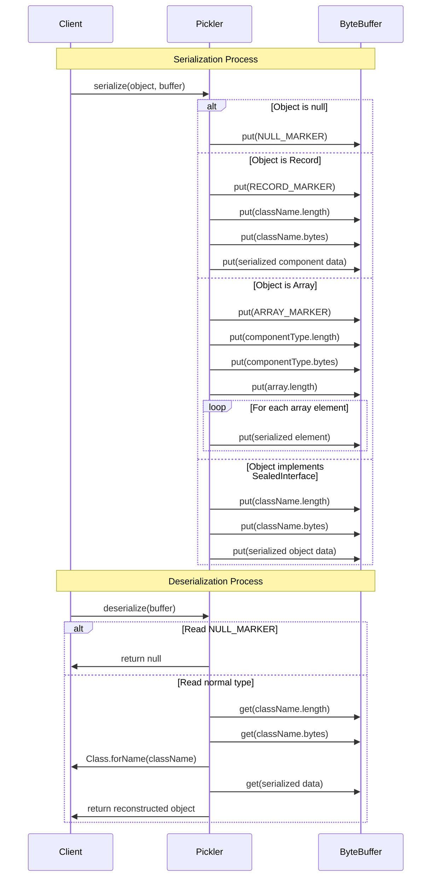

# Simple Pickler

Simple Pickler is a lightweight Java serialization library that dynamically generates type-safe serializers for Java records and sealed traits. It avoids excessive reflection when working with objects by caching MethodHandle. It works with nested sealed traits that permit nested simple records of simple types: 

- Records containing primitive types or String
- Optional of primitive types or String
- Arrays (including primitive arrays, object arrays, and nested arrays)
- Nested records that only contain the above type 
- Sealed interfaces with record implementations that only contain the above types
- Nested sealed interfaces that only contain the above types

Those restrictions are rich enough to build a message protocol suitable for pattern-matching destructuring switch expressions. 

An example protocol could look like this:

```java
// Client to server messages
sealed interface StackCommand permits Push, Pop, Peek {}
record Push(String item) implements StackCommand {}
record Pop() implements StackCommand {}
record Peek() implements StackCommand {}
// Server responses
sealed interface StackResponse permits Success, Failure {
  String payload();
}
record Success(Optional<String> value) implements StackResponse {
  public String payload() { return value.orElse(null); }
}
record Failure(String errorMessage) implements StackResponse {
  public String payload() { return errorMessage;}
}
```

Note that there is deliberately no common interface between the client and server protocols. This means that we would 
create two type-safe picklers, one for the client and one for the server. This is a deliberate design choice to avoid 
needing to do unchecked casts when deserializing: 

```java
// Get picklers for the protocol interfaces
Pickler<StackCommand> commandPickler = Pickler.picklerForSealedTrait(StackCommand.class);
Pickler<StackResponse> responsePickler = Pickler.picklerForSealedTrait(StackResponse.class);
```

See the unit tests for many examples of using the library.

## Usage Examples

### Basic Record Serialization

```java
/// Define a simple record
/// The constructor must be public so that we can invoke the canonical constructor form the pickler package
public record Person(String name, int age) {
}

// Create an instance
var person = new Person("Alice", 30);

// Get a pickler for the record type
Pickler<Person> pickler = Pickler.picklerForRecord(Person.class);

// Serialize to a ByteBuffer
ByteBuffer buffer = ByteBuffer.allocate(1024);
pickler.serialize(person, buffer);
buffer.flip();

// Deserialize from the ByteBuffer
Person deserializedPerson = pickler.deserialize(buffer);
```

### Complex Example Nested Sealed Interfaces

```java
// Protocol
sealed interface Animal permits Mammal, Bird, Alicorn {}
sealed interface Mammal extends Animal permits Dog, Cat { }
sealed interface Bird extends Animal permits Eagle, Penguin {}
public record Alicorn(String name, String[] magicPowers) implements Animal {}
public record Dog(String name, int age) implements Mammal {}
public record Cat(String name, boolean purrs) implements Mammal {}
public record Eagle(double wingspan) implements Bird {}
record Penguin(boolean canSwim) implements Bird {}

// Create instances of different Animal implementations
Dog dog = new Dog("Buddy", 3);
Animal eagle = new Eagle(2.1);
Alicorn alicorn = new Alicorn("Twilight Sparkle", new String[]{"elements of harmony", "wings of a pegasus"});

// Get a pickler for the sealed trait Animal
var animalPickler = picklerForSealedTrait(Animal.class);

// Serialize and deserialize the Dog instance
var dogBuffer = ByteBuffer.allocate(64);
animalPickler.serialize(dog, dogBuffer);
dogBuffer.flip();
var returnedDog = animalPickler.deserialize(dogBuffer);

// equality is true for all fields
assert dog.equals(returnedDog);

// Alicorns have magic powers
var alicornBuffer = ByteBuffer.allocate(256);
animalPickler.serialize(alicorn, alicornBuffer);
alicornBuffer.flip();
var returnedAlicorn = (Alicorn) animalPickler.deserialize(alicornBuffer);

// nested arrays of string are supported
assert Arrays.equals(alicorn.magicPowers(), returnedAlicorn.magicPowers();
```

## Wire Protocol

Support Types And Their Type Markers

| Type      | Type Marker |
|-----------|-------------|
| null | 	1          |
| Boolean | 	2          |
| Byte | 	 3         |
| Short | 	 4         |
| Character | 	5          |
| Integer | 6           |
| Long | 	 7         |
| Float | 	 8         |
| Double | 	 9         |
| String | 	10         |
| Optional | 	11         |
| Record | 	12         |
| Array | 	13         |

The wire protocol is explained in this diagram: 




## License

SPDX-FileCopyrightText: 2025 Simon Massey
SPDX-License-Identifier: Apache-2.0
